# Design Patterns Implementation Documentation

## Table of Contents
1. [Singleton Pattern](#1-singleton-pattern)
2. [Facade Pattern](#2-facade-pattern)
3. [Strategy Pattern](#3-strategy-pattern)
4. [Adapter Pattern](#4-adapter-pattern)

---

## 1. Singleton Pattern

### i. Function or Software Component Affected

**Component:** Database Access Layer  
**Class:** `DbClient` (located in `Data/DbClient.cs`)

The Singleton pattern is implemented in the database client to ensure that only one instance of the database connection manager exists throughout the application lifecycle. This provides a centralized, thread-safe access point for all database operations.

### ii. Description of Workflow or Data Flow

The workflow for database access using the Singleton pattern follows these steps:

1. **Instance Request:** Application component requests database access via `DbClient.Instance`
2. **Lazy Initialization:** On first access, the `Lazy<T>` wrapper creates the single `DbClient` instance
3. **Subsequent Access:** All future requests return the same instance (no new instantiation)
4. **Context Creation:** The singleton instance creates and returns `AiClinicDbContext` instances as needed
5. **Database Operations:** Services use the context to perform CRUD operations
6. **Context Disposal:** Each context is disposed after use (using statement), but the singleton persists

**Data Flow:**
```
Service Layer → DbClient.Instance → GetDb() → AiClinicDbContext → SQLite Database
     ↓                                              ↓
  Dispose Context                            Execute Query/Command
     ↓                                              ↓
  Singleton Persists                          Return Results
```

### iii. Class Diagram

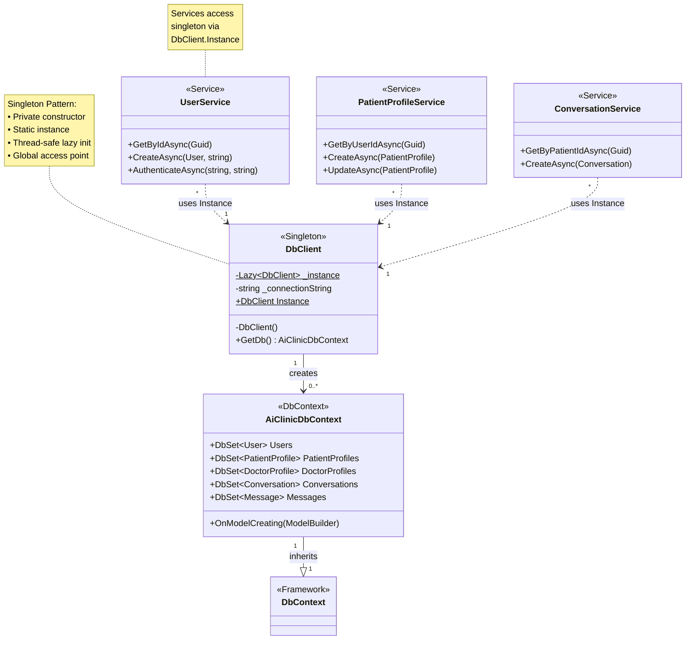

### iv. Other UML Notations (Sequence Diagram)

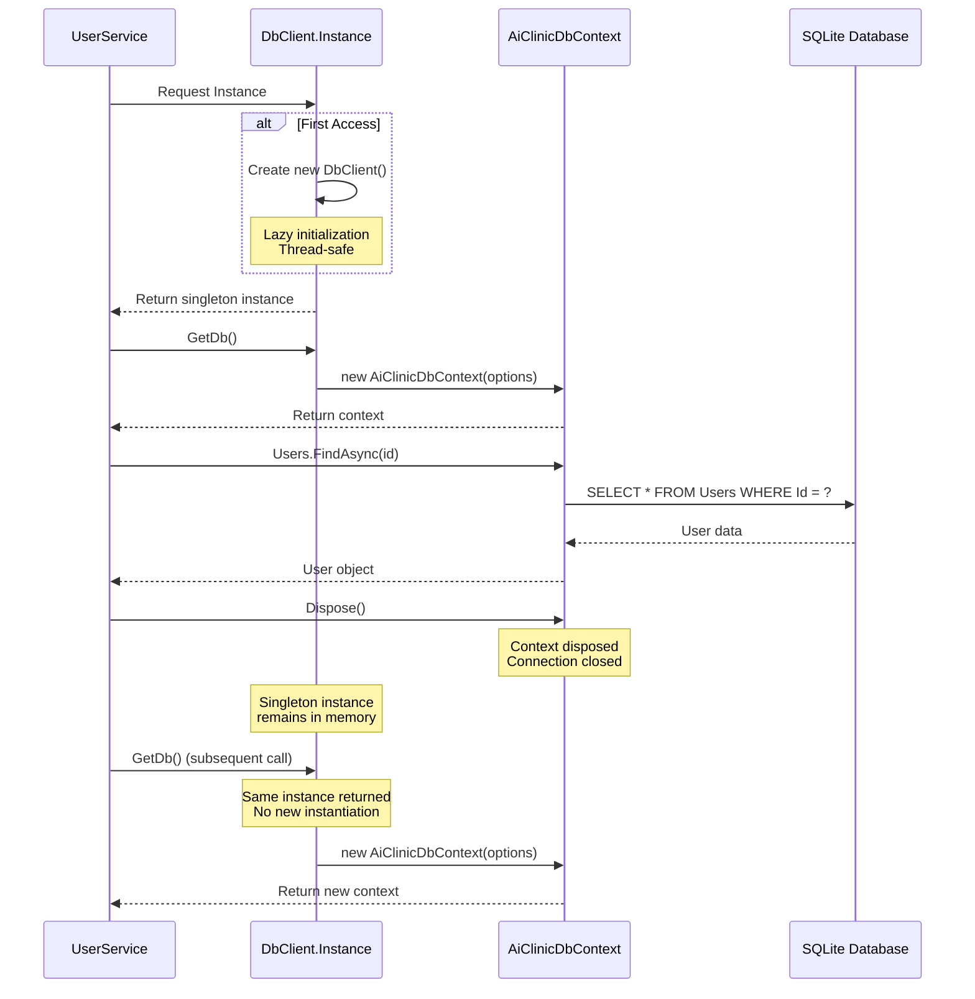

### v. Sample Potential Code

```csharp
using Microsoft.EntityFrameworkCore;
using ai_clinic.Models;

namespace ai_clinic.Data;

/// <summary>
/// SINGLETON PATTERN - Database Singleton
/// Global unique database access entry point
/// </summary>
public sealed class DbClient
{
    // Private static instance - Uses Lazy<T> for thread-safe lazy initialization
    private static readonly Lazy<DbClient> _instance = 
        new Lazy<DbClient>(() => new DbClient());
    
    // Database connection string
    private readonly string _connectionString;

    // Private constructor - Prevents external instantiation
    private DbClient()
    {
        _connectionString = "Data Source=ai-clinic.db";
    }

    /// <summary>
    /// Gets singleton instance - global unique entry point
    /// Usage: using var db = DbClient.Instance.GetDb();
    /// </summary>
    public static DbClient Instance => _instance.Value;

    /// <summary>
    /// Gets database context
    /// </summary>
    public AiClinicDbContext GetDb()
    {
        var options = new DbContextOptionsBuilder<AiClinicDbContext>()
            .UseSqlite(_connectionString)
            .Options;
            
        return new AiClinicDbContext(options);
    }
}

// Usage Example in Service Layer
public class UserService
{
    public async Task<User?> GetByIdAsync(Guid userId)
    {
        // Access singleton instance and get database context
        using var db = DbClient.Instance.GetDb();
        
        // Perform database operation
        return await db.Users
            .Include(u => u.PatientProfile)
            .Include(u => u.DoctorProfile)
            .FirstOrDefaultAsync(u => u.Id == userId);
    }
    
    public async Task<User> CreateAsync(User user, string password)
    {
        using var db = DbClient.Instance.GetDb();
        
        // Hash password
        user.PasswordHash = BCrypt.Net.BCrypt.HashPassword(password);
        user.CreatedAt = DateTime.UtcNow;
        user.UpdatedAt = DateTime.UtcNow;
        
        // Add to database
        db.Users.Add(user);
        await db.SaveChangesAsync();
        
        return user;
    }
}

// Thread Safety Demonstration
public class ConcurrentAccessExample
{
    public async Task DemonstrateThreadSafety()
    {
        // Multiple threads accessing the singleton
        var tasks = new List<Task>();
        
        for (int i = 0; i < 10; i++)
        {
            tasks.Add(Task.Run(async () =>
            {
                var instance = DbClient.Instance;
                using var db = instance.GetDb();
                var users = await db.Users.ToListAsync();
                Console.WriteLine($"Thread {Thread.CurrentThread.ManagedThreadId}: " +
                                $"Instance HashCode = {instance.GetHashCode()}");
            }));
        }
        
        await Task.WhenAll(tasks);
        // All threads will report the same HashCode, proving single instance
    }
}
```

### vi. Benefits

1. **Controlled Access to Single Instance**
   - Ensures only one database client manager exists
   - Prevents multiple connection string configurations
   - Centralizes database access logic

2. **Thread Safety**
   - `Lazy<T>` provides built-in thread-safe initialization
   - No need for manual locking mechanisms
   - Safe for concurrent access in multi-threaded environments

3. **Lazy Initialization**
   - Instance created only when first accessed
   - Reduces application startup time
   - Conserves memory if database access is not immediately needed

4. **Global Access Point**
   - Accessible from anywhere in the application via `DbClient.Instance`
   - Eliminates need to pass database client through constructors
   - Simplifies dependency management for database access

5. **Resource Management**
   - Single point of control for connection string configuration
   - Consistent database context creation
   - Facilitates connection pooling and resource optimization

6. **Testability**
   - Can be mocked or replaced in unit tests
   - Sealed class prevents unintended inheritance
   - Clear separation between singleton manager and context instances

### vii. Limitations

1. **Global State**
   - Introduces global state into the application
   - Can make testing more difficult as state persists across tests
   - May hide dependencies in class constructors

2. **Tight Coupling**
   - Services become tightly coupled to the `DbClient` implementation
   - Difficult to swap implementations without code changes
   - Violates dependency inversion principle

3. **Concurrency Issues**
   - While the singleton itself is thread-safe, the contexts it creates are not
   - Each context must be used in a single thread
   - Requires careful management of context lifecycle

4. **Difficult to Subclass**
   - Sealed class prevents inheritance
   - Cannot create specialized versions for different environments
   - Limited extensibility

5. **Hidden Dependencies**
   - Static access hides the dependency on database access
   - Makes it harder to understand class dependencies
   - Can lead to unexpected coupling

6. **Testing Challenges**
   - Cannot easily replace with mock implementation
   - Static nature makes unit testing more complex
   - May require special test setup/teardown

7. **Lifecycle Management**
   - Singleton lives for entire application lifetime
   - Cannot be disposed or recreated without application restart
   - May hold resources longer than necessary

**Mitigation Strategies:**

- Use dependency injection for services instead of direct singleton access
- Create interfaces for database access to enable mocking
- Implement factory pattern for context creation to improve testability
- Consider using scoped services in ASP.NET Core instead of singleton for better lifecycle management

---

## 2. Facade Pattern

### i. Function or Software Component Affected

**Component:** Patient Management System  
**Class:** `PatientFacade` (located in `Services/Facades/PatientFacade.cs`)

The Facade pattern provides a unified, simplified interface to complex subsystems. In this application, the PatientFacade coordinates multiple services to complete high-level patient-related business operations, hiding the complexity of service interactions from the UI layer.

**Subsystems Coordinated by PatientFacade:**
- `PatientProfileService` - Patient profile management
- `ConversationService` - Conversation management
- `MedicalRecordService` - Medical records
- `PrescriptionService` - Prescription management
- `ConsultationService` - Consultation management
- `ActivityLogService` - Activity logging
- `DocumentService` - Document management
- `MedicalRecordExportService` - Record export functionality

### ii. Description of Workflow or Data Flow

**PatientFacade Dashboard Data Workflow:**

1. **Parallel Data Retrieval:** Execute multiple service calls concurrently:
   - Get patient profile from `PatientProfileService`
   - Get conversations from `ConversationService`
   - Get medical records from `MedicalRecordService`
   - Get prescriptions from `PrescriptionService`
2. **Data Aggregation:** Wait for all tasks to complete using `Task.WhenAll`
3. **Data Processing:** Filter and sort data:
   - Select 3 most recent conversations
   - Filter active prescriptions
   - Find upcoming appointments
   - Get recent health metrics
4. **Activity Logging:** Log dashboard view via `ActivityLogService`
5. **Result Return:** Return aggregated `PatientDashboardData` DTO

**PatientFacade Medical Records Upload Workflow:**

1. **Input Validation:** Validate document data, title, and type
2. **Document Creation:** Create `Document` entity with file data
3. **Document Storage:** Save document via `DocumentService`
4. **Activity Logging:** Log upload event via `ActivityLogService` with metadata
5. **Result Return:** Return created `Document` object

**PatientFacade Export Records Workflow:**

1. **Data Retrieval:** Get patient records via `MedicalRecordExportService`
2. **PDF Generation:** Export service generates PDF from records
3. **Activity Logging:** Log export event with file size and date range
4. **Result Return:** Return PDF as byte array

**Data Flow Diagram:**
```
UI Layer (Razor Pages)
        ↓
    PatientFacade
        ↓
    ┌───┴───┬───────┬──────────┬─────────┬─────────┐
    ↓       ↓       ↓          ↓         ↓         ↓
Profile Conversation Medical  Prescription Document Activity
Service   Service   Record    Service      Service  Log
                    Service                         Service
    ↓       ↓       ↓          ↓         ↓         ↓
            Database (via DbClient)
```

### iii. Class Diagram

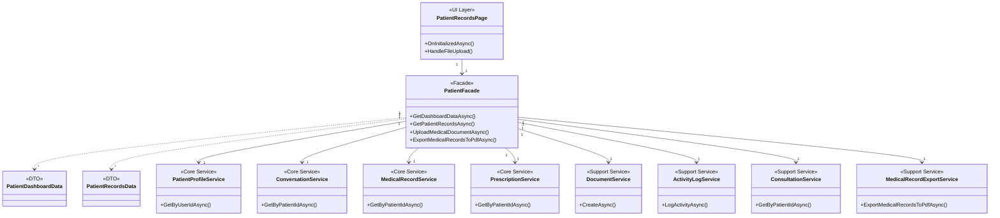

### iv. Other UML Notations (Sequence Diagram)

**Patient Dashboard Data Retrieval Sequence:**

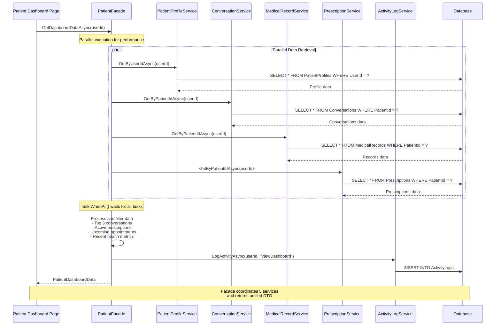

**Medical Document Upload Sequence:**

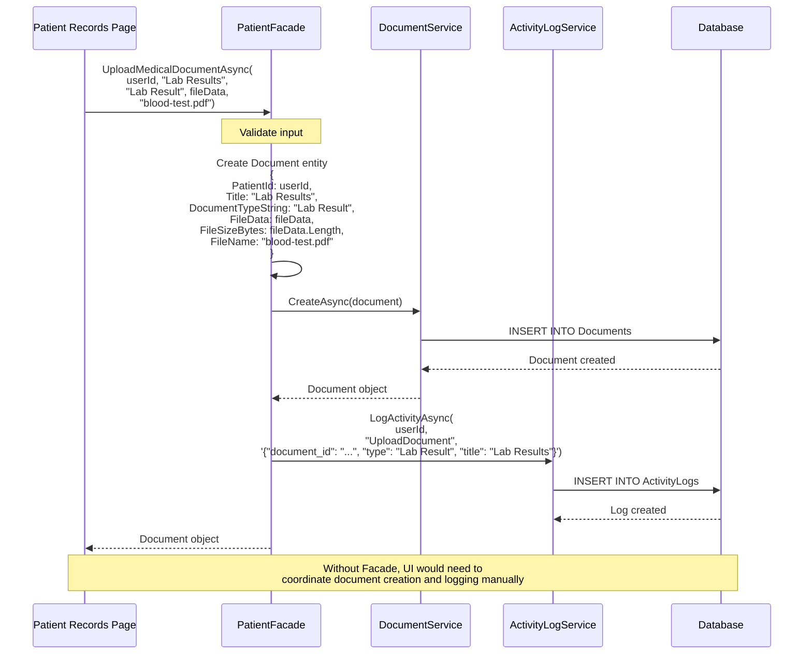

**Medical Records Export Sequence:**

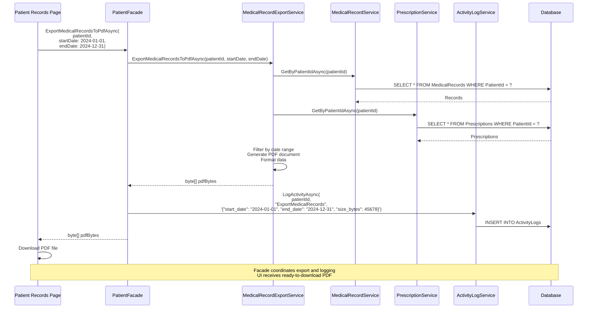

### v. Sample Potential Code

```csharp
using ai_clinic.Models;

namespace ai_clinic.Services.Facades;

/// <summary>
/// Facade Pattern: Simplifies patient operations
/// Coordinates 8 subsystems for patient management
/// </summary>
public class PatientFacade
{
    private readonly PatientProfileService _patientProfileService;
    private readonly ConversationService _conversationService;
    private readonly MedicalRecordService _medicalRecordService;
    private readonly PrescriptionService _prescriptionService;
    private readonly ConsultationService _consultationService;
    private readonly ActivityLogService _activityLogService;
    private readonly DocumentService _documentService;
    private readonly MedicalRecordExportService _exportService;

    public PatientFacade(
        PatientProfileService patientProfileService,
        ConversationService conversationService,
        MedicalRecordService medicalRecordService,
        PrescriptionService prescriptionService,
        ConsultationService consultationService,
        ActivityLogService activityLogService,
        DocumentService documentService,
        MedicalRecordExportService exportService)
    {
        _patientProfileService = patientProfileService;
        _conversationService = conversationService;
        _medicalRecordService = medicalRecordService;
        _prescriptionService = prescriptionService;
        _consultationService = consultationService;
        _activityLogService = activityLogService;
        _documentService = documentService;
        _exportService = exportService;
    }

    /// <summary>
    /// Get complete dashboard data - Coordinates 5 services in parallel
    /// </summary>
    public async Task<PatientDashboardData> GetDashboardDataAsync(Guid userId)
    {
        // Execute multiple service calls in parallel for performance
        var profileTask = _patientProfileService.GetByUserIdAsync(userId);
        var conversationsTask = _conversationService.GetByPatientIdAsync(userId);
        var medicalRecordsTask = _medicalRecordService.GetByPatientIdAsync(userId);
        var prescriptionsTask = _prescriptionService.GetByPatientIdAsync(userId);

        // Wait for all tasks to complete
        await Task.WhenAll(
            profileTask, 
            conversationsTask, 
            medicalRecordsTask, 
            prescriptionsTask);

        var conversations = await conversationsTask;
        var medicalRecords = await medicalRecordsTask;

        // Log activity
        await _activityLogService.LogActivityAsync(userId, "ViewDashboard");

        // Aggregate and return data
        return new PatientDashboardData
        {
            Profile = await profileTask,
            RecentConversations = conversations
                .OrderByDescending(c => c.UpdatedAt)
                .Take(3)
                .ToList(),
            MedicalRecords = medicalRecords,
            ActivePrescriptions = (await prescriptionsTask)
                .Where(p => p.IsActive)
                .ToList(),
            UpcomingAppointment = conversations
                .Where(c => c.Status == ConversationStatus.Active && 
                           c.AssignedDoctorId.HasValue)
                .OrderBy(c => c.CreatedAt)
                .FirstOrDefault(),
            RecentHealthMetric = medicalRecords
                .Where(r => r.RecordType == "Lab Result")
                .OrderByDescending(r => r.RecordDate)
                .FirstOrDefault()
        };
    }

    /// <summary>
    /// Get all medical records with statistics - Coordinates 3 services
    /// </summary>
    public async Task<PatientRecordsData> GetPatientRecordsAsync(Guid userId)
    {
        // Get all records in parallel
        var medicalRecordsTask = _medicalRecordService.GetByPatientIdAsync(userId);
        var prescriptionsTask = _prescriptionService.GetByPatientIdAsync(userId);
        var documentsTask = _documentService.GetByPatientIdAsync(userId);

        await Task.WhenAll(medicalRecordsTask, prescriptionsTask, documentsTask);

        var medicalRecords = await medicalRecordsTask;
        var prescriptions = await prescriptionsTask;
        var documents = await documentsTask;

        // Calculate statistics
        var stats = new RecordStatistics
        {
            TotalRecords = medicalRecords.Count + prescriptions.Count + documents.Count,
            LabResults = medicalRecords.Count(r => r.RecordType == "Lab Result"),
            Prescriptions = prescriptions.Count,
            ImagingStudies = medicalRecords.Count(r => r.RecordType == "Imaging"),
            VisitNotes = medicalRecords.Count(r => r.RecordType == "Visit Note"),
            Immunizations = medicalRecords.Count(r => r.RecordType == "Immunization")
        };

        // Log activity
        await _activityLogService.LogActivityAsync(userId, "ViewMedicalRecords");

        return new PatientRecordsData
        {
            MedicalRecords = medicalRecords,
            Prescriptions = prescriptions,
            Documents = documents,
            Statistics = stats
        };
    }

    /// <summary>
    /// Upload medical document - Coordinates document creation and logging
    /// </summary>
    public async Task<Document> UploadMedicalDocumentAsync(
        Guid userId,
        string title,
        string documentType,
        byte[] fileData,
        string fileName,
        string? description = null)
    {
        var document = new Document
        {
            PatientId = userId,
            Title = title,
            DocumentTypeString = documentType,
            FileName = fileName,
            FileData = fileData,
            FileSizeBytes = fileData.Length,
            Description = description,
            UploadedByUserId = userId,
            CreatedAt = DateTime.UtcNow,
            FileUrl = "",
            FileType = DocumentType.Other
        };

        document = await _documentService.CreateAsync(document);

        await _activityLogService.LogActivityAsync(
            userId,
            "UploadDocument",
            $"{{\"document_id\": \"{document.Id}\", \"type\": \"{documentType}\", \"title\": \"{title}\"}}");

        return document;
    }

    /// <summary>
    /// Export medical records to PDF - Coordinates export and logging
    /// </summary>
    public async Task<byte[]> ExportMedicalRecordsToPdfAsync(
        Guid patientId,
        DateTime? startDate = null,
        DateTime? endDate = null)
    {
        // Delegate to export service
        var pdfBytes = await _exportService.ExportMedicalRecordsToPdfAsync(
            patientId, 
            startDate, 
            endDate);

        // Log the export activity
        await _activityLogService.LogActivityAsync(
            patientId,
            "ExportMedicalRecords",
            $"{{\"start_date\": \"{startDate?.ToString("yyyy-MM-dd") ?? "all"}\", " +
            $"\"end_date\": \"{endDate?.ToString("yyyy-MM-dd") ?? "all"}\", " +
            $"\"size_bytes\": {pdfBytes.Length}}}");

        return pdfBytes;
    }

    /// <summary>
    /// Get medical timeline - Coordinates multiple services and aggregates data
    /// </summary>
    public async Task<List<TimelineItem>> GetMedicalTimelineAsync(Guid userId)
    {
        var recordsData = await GetPatientRecordsAsync(userId);
        var timeline = new List<TimelineItem>();

        // Add medical records
        foreach (var record in recordsData.MedicalRecords)
        {
            timeline.Add(new TimelineItem
            {
                Date = record.RecordDate,
                Title = record.Title,
                Type = record.RecordType,
                Description = record.Content
            });
        }

        // Add prescriptions
        foreach (var prescription in recordsData.Prescriptions)
        {
            timeline.Add(new TimelineItem
            {
                Date = prescription.CreatedAt,
                Title = $"Prescription - {prescription.MedicationName}",
                Type = "Prescription",
                Description = prescription.Dosage
            });
        }

        // Add documents
        foreach (var document in recordsData.Documents)
        {
            timeline.Add(new TimelineItem
            {
                Date = document.CreatedAt,
                Title = document.Title ?? document.FileName,
                Type = document.DocumentTypeString ?? document.FileType.ToString(),
                Description = document.Description
            });
        }

        // Sort by date descending
        return timeline.OrderByDescending(t => t.Date).ToList();
    }

    /// <summary>
    /// Delete medical record - Coordinates deletion and logging
    /// </summary>
    public async Task<bool> DeleteMedicalRecordAsync(
        Guid userId, 
        Guid recordId, 
        string recordType)
    {
        bool success = false;

        switch (recordType.ToLower())
        {
            case "medical_record":
                success = await _medicalRecordService.DeleteAsync(recordId);
                break;
            case "prescription":
                success = await _prescriptionService.DeleteAsync(recordId);
                break;
            case "document":
                success = await _documentService.DeleteAsync(recordId);
                break;
        }

        if (success)
        {
            await _activityLogService.LogActivityAsync(
                userId,
                "DeleteMedicalRecord",
                $"{{\"record_id\": \"{recordId}\", \"type\": \"{recordType}\"}}");
        }

        return success;
    }
}

// Data Transfer Objects
public class PatientDashboardData
{
    public PatientProfile? Profile { get; set; }
    public List<Conversation> RecentConversations { get; set; } = new();
    public List<MedicalRecord> MedicalRecords { get; set; } = new();
    public List<Prescription> ActivePrescriptions { get; set; } = new();
    public Conversation? UpcomingAppointment { get; set; }
    public MedicalRecord? RecentHealthMetric { get; set; }
}

public class PatientRecordsData
{
    public List<MedicalRecord> MedicalRecords { get; set; } = new();
    public List<Prescription> Prescriptions { get; set; } = new();
    public List<Document> Documents { get; set; } = new();
    public RecordStatistics Statistics { get; set; } = new();
}

public class RecordStatistics
{
    public int TotalRecords { get; set; }
    public int LabResults { get; set; }
    public int Prescriptions { get; set; }
    public int ImagingStudies { get; set; }
    public int VisitNotes { get; set; }
    public int Immunizations { get; set; }
}

public class TimelineItem
{
    public DateTime Date { get; set; }
    public string Title { get; set; } = string.Empty;
    public string Type { get; set; } = string.Empty;
    public string? Description { get; set; }
}
```

**Usage Example in Razor Page:**

```csharp
@page "/patient/records"
@inject PatientFacade PatientFacade
@inject AuthFacade AuthFacade

@code {
    private PatientRecordsData? recordsData;
    private List<TimelineItem>? timeline;
    private bool isLoading = true;

    protected override async Task OnInitializedAsync()
    {
        var userId = AuthFacade.CurrentUser?.Id;
        if (userId.HasValue)
        {
            // Without Facade - Complex coordination required
            // var records = await medicalRecordService.GetByPatientIdAsync(userId.Value);
            // var prescriptions = await prescriptionService.GetByPatientIdAsync(userId.Value);
            // var documents = await documentService.GetByPatientIdAsync(userId.Value);
            // var stats = CalculateStatistics(records, prescriptions, documents);
            // await activityLogService.LogActivityAsync(userId.Value, "ViewMedicalRecords");
            
            // With Facade - Single method call
            recordsData = await PatientFacade.GetPatientRecordsAsync(userId.Value);
            timeline = await PatientFacade.GetMedicalTimelineAsync(userId.Value);
            
            isLoading = false;
        }
    }

    private async Task HandleFileUpload(InputFileChangeEventArgs e)
    {
        var file = e.File;
        var userId = AuthFacade.CurrentUser?.Id;
        
        if (userId.HasValue && file != null)
        {
            using var stream = file.OpenReadStream(maxAllowedSize: 10 * 1024 * 1024);
            using var memoryStream = new MemoryStream();
            await stream.CopyToAsync(memoryStream);
            var fileData = memoryStream.ToArray();

            // Facade handles document creation and logging
            var document = await PatientFacade.UploadMedicalDocumentAsync(
                userId.Value,
                title: file.Name,
                documentType: "Lab Result",
                fileData: fileData,
                fileName: file.Name,
                description: "Uploaded by patient"
            );

            // Refresh data
            recordsData = await PatientFacade.GetPatientRecordsAsync(userId.Value);
            StateHasChanged();
        }
    }

    private async Task ExportToPdf()
    {
        var userId = AuthFacade.CurrentUser?.Id;
        if (userId.HasValue)
        {
            // Facade coordinates export and logging
            var pdfBytes = await PatientFacade.ExportMedicalRecordsToPdfAsync(
                userId.Value,
                startDate: DateTime.Now.AddYears(-1),
                endDate: DateTime.Now
            );

            // Download file
            await JSRuntime.InvokeVoidAsync("downloadFile", 
                "medical-records.pdf", 
                Convert.ToBase64String(pdfBytes));
        }
    }

    private async Task DeleteRecord(Guid recordId, string recordType)
    {
        var userId = AuthFacade.CurrentUser?.Id;
        if (userId.HasValue)
        {
            // Facade handles deletion and logging
            var success = await PatientFacade.DeleteMedicalRecordAsync(
                userId.Value,
                recordId,
                recordType
            );

            if (success)
            {
                // Refresh data
                recordsData = await PatientFacade.GetPatientRecordsAsync(userId.Value);
                StateHasChanged();
            }
        }
    }
}
```

**Comparison: Without Facade vs With Facade**

```csharp
// WITHOUT FACADE - UI must coordinate multiple services
public class PatientRecordsPageWithoutFacade
{
    private readonly MedicalRecordService _medicalRecordService;
    private readonly PrescriptionService _prescriptionService;
    private readonly DocumentService _documentService;
    private readonly ActivityLogService _activityLogService;

    protected override async Task OnInitializedAsync()
    {
        var userId = GetCurrentUserId();

        // UI must coordinate all service calls
        var recordsTask = _medicalRecordService.GetByPatientIdAsync(userId);
        var prescriptionsTask = _prescriptionService.GetByPatientIdAsync(userId);
        var documentsTask = _documentService.GetByPatientIdAsync(userId);

        await Task.WhenAll(recordsTask, prescriptionsTask, documentsTask);

        var records = await recordsTask;
        var prescriptions = await prescriptionsTask;
        var documents = await documentsTask;

        // UI must calculate statistics
        var stats = new RecordStatistics
        {
            TotalRecords = records.Count + prescriptions.Count + documents.Count,
            LabResults = records.Count(r => r.RecordType == "Lab Result"),
            Prescriptions = prescriptions.Count,
            // ... more calculations
        };

        // UI must remember to log activity
        await _activityLogService.LogActivityAsync(userId, "ViewMedicalRecords");

        // UI must construct result object
        recordsData = new PatientRecordsData
        {
            MedicalRecords = records,
            Prescriptions = prescriptions,
            Documents = documents,
            Statistics = stats
        };
    }
}

// WITH FACADE - UI uses simple interface
public class PatientRecordsPageWithFacade
{
    private readonly PatientFacade _patientFacade;

    protected override async Task OnInitializedAsync()
    {
        var userId = GetCurrentUserId();

        // Single method call - Facade handles everything
        recordsData = await _patientFacade.GetPatientRecordsAsync(userId);
    }
}
```

### vi. Benefits

1. **Simplified Interface**
   - UI layer interacts with single facade instead of multiple services
   - Reduces complexity of client code
   - Single method call replaces multiple coordinated service calls

2. **Loose Coupling**
   - UI layer decoupled from subsystem implementations
   - Changes to subsystems don't affect UI code
   - Easy to modify internal service coordination without breaking clients

3. **Improved Maintainability**
   - Business logic centralized in facade
   - Easier to understand high-level operations
   - Clear separation between orchestration and implementation

4. **Better Performance**
   - Parallel execution of independent service calls using `Task.WhenAll`
   - Reduces total execution time for dashboard data retrieval
   - Optimized data aggregation in single location

5. **Consistent Error Handling**
   - Unified error handling and result objects (`AuthResult`)
   - Consistent exception management across operations
   - Simplified error reporting to UI layer

6. **Enhanced Testability**
   - Facade can be mocked for UI testing
   - Business logic tested independently of UI
   - Clear boundaries for unit testing

7. **Activity Logging**
   - Centralized logging of high-level operations
   - Consistent audit trail
   - Easier to track user actions

8. **Transaction Management**
   - Facade can coordinate transactions across multiple services
   - Ensures data consistency
   - Simplifies rollback logic

### vii. Limitations

1. **Additional Layer of Abstraction**
   - Adds another layer between UI and services
   - May introduce unnecessary complexity for simple operations
   - Can make debugging more difficult

2. **Potential Performance Overhead**
   - Extra method calls through facade layer
   - May aggregate more data than needed for specific use cases
   - Parallel execution requires careful management

3. **God Object Risk**
   - Facade can become too large with too many responsibilities
   - May violate Single Responsibility Principle
   - Difficult to maintain if it grows too complex

4. **Limited Flexibility**
   - Facade provides fixed set of operations
   - UI cannot easily customize service coordination
   - May need to expose underlying services for advanced scenarios

5. **Dependency Management**
   - Facade depends on many subsystems
   - Changes to any subsystem may require facade updates
   - Constructor injection becomes complex with many dependencies

6. **Testing Complexity**
   - Facade tests require mocking multiple services
   - Integration tests become more complex
   - Difficult to test all coordination paths

7. **Duplication Risk**
   - May duplicate functionality from underlying services
   - Risk of inconsistent behavior between facade and direct service access
   - Maintenance burden of keeping facade synchronized

**Mitigation Strategies:**

- Keep facades focused on specific domains (Auth, Patient, Doctor)
- Provide both facade and direct service access for flexibility
- Use dependency injection to manage facade dependencies
- Document which operations should use facade vs direct service access
- Implement comprehensive integration tests for facade operations
- Consider using mediator pattern for complex coordination scenarios

---

## 3. Strategy Pattern

### i. Function or Software Component Affected

**Component:** AI Model Selection and Execution System  
**Classes:**
- **Strategy Interface:** `IAiModelStrategy` (located in `Services/AI/IAiModelStrategy.cs`)
- **Context:** `AiModelContext` (located in `Services/AI/AiModelContext.cs`)
- **Concrete Strategies:**
  - `OwlAlphaStrategy` - OpenRouter Owl Alpha model
  - `Gemma4Strategy` - Google Gemma 4 26B model
  - `MiniMaxStrategy` - MiniMax model
  - `NemotronStrategy` - Nemotron model

The Strategy pattern defines a family of algorithms (AI models), encapsulates each one, and makes them interchangeable. This allows the AI model to be selected and switched at runtime without changing the client code.

### ii. Description of Workflow or Data Flow

**AI Model Strategy Workflow:**

1. **Initialization:** `AiModelContext` is created with `OpenRouterApiClient` dependency
2. **Strategy Registration:** All available AI model strategies are registered in a dictionary
3. **Default Selection:** Default strategy (Owl Alpha) is set as the current strategy
4. **Client Request:** Client calls `GenerateResponseAsync` on the context
5. **Strategy Delegation:** Context delegates the request to the current strategy
6. **API Adaptation:** Strategy adapts the request to OpenRouter API format
7. **API Call:** Strategy calls OpenRouter API through the API client
8. **Response Adaptation:** Strategy converts API response to unified format
9. **Result Return:** Adapted response is returned to client
10. **Strategy Switching:** Client can switch strategies at any time using `SetStrategy`

**Data Flow:**

```
Client Code
    ↓
AiModelContext.GenerateResponseAsync(prompt)
    ↓
CurrentStrategy.GenerateResponseAsync(prompt)
    ↓
BaseAiModelAdapter (Adapter Pattern)
    ↓
OpenRouterApiClient.CallApiAsync(request)
    ↓
OpenRouter API (External Service)
    ↓
Response flows back through the same chain
```

**Strategy Switching Flow:**

```
Client → AiModelContext.SetStrategy("gemma-4")
    ↓
Context updates _currentStrategy reference
    ↓
Next GenerateResponseAsync() uses new strategy
    ↓
Different AI model processes the request
```

### iii. Class Diagram

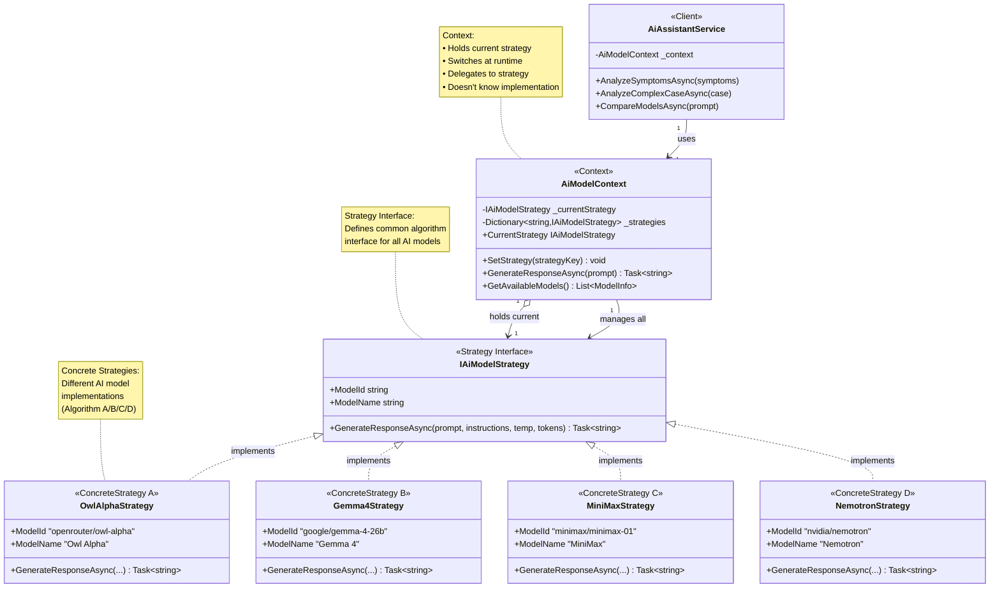

### iv. Other UML Notations (Sequence Diagram)

**AI Response Generation with Strategy Selection:**

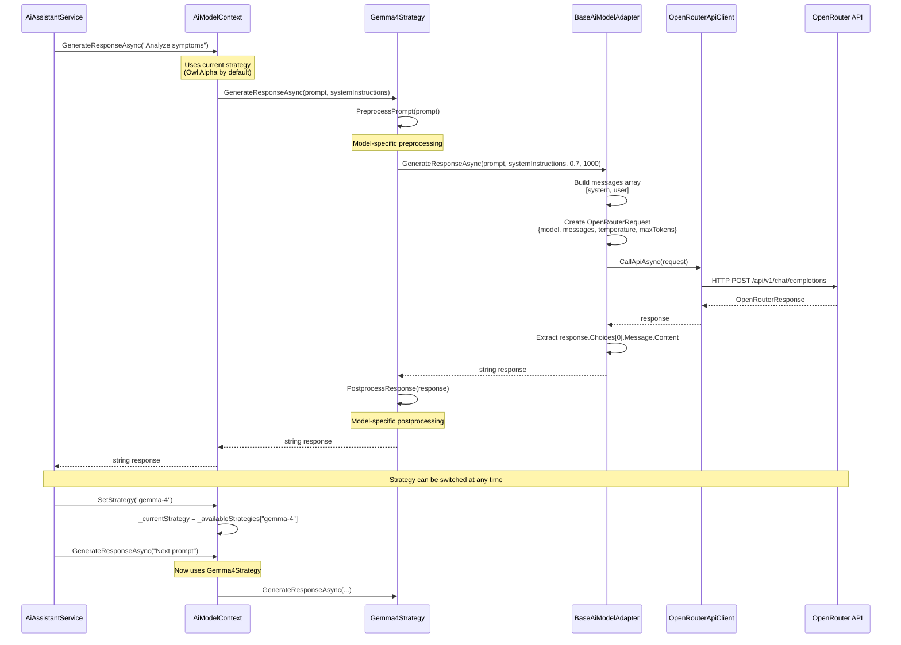

**Strategy Switching Sequence:**

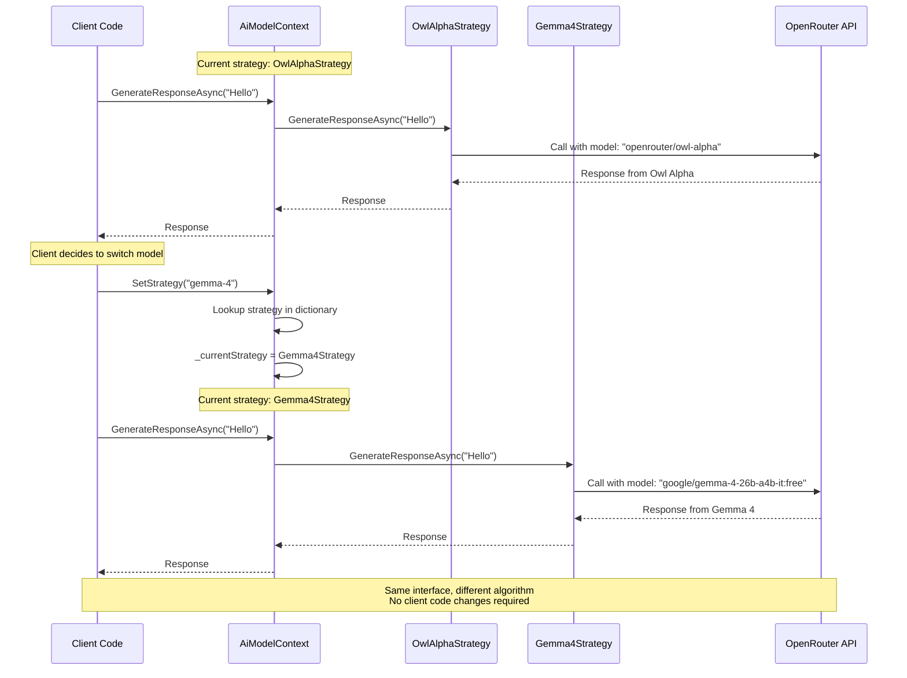

### v. Sample Potential Code

```csharp
using ai_clinic.Services.AI.Strategies;

namespace ai_clinic.Services.AI;

/// <summary>
/// Strategy Interface - Defines contract for all AI model strategies
/// </summary>
public interface IAiModelStrategy
{
    string ModelId { get; }
    string ModelName { get; }
    bool SupportsVision { get; }
    
    Task<string> GenerateResponseAsync(
        string prompt,
        string? systemInstructions = null,
        double temperature = 0.7,
        int maxTokens = 1000
    );
    
    Task<string> GenerateResponseWithImagesAsync(
        string prompt,
        List<string> imageBase64List,
        string? systemInstructions = null,
        double temperature = 0.7,
        int maxTokens = 1000
    );
    
    Task<IAsyncEnumerable<string>> GenerateStreamingResponseAsync(
        string prompt,
        string? systemInstructions = null,
        double temperature = 0.7,
        int maxTokens = 1000
    );
}

/// <summary>
/// Context - Manages AI model strategy selection and execution
/// </summary>
public class AiModelContext
{
    private IAiModelStrategy _currentStrategy;
    private readonly Dictionary<string, IAiModelStrategy> _availableStrategies;
    private readonly OpenRouterApiClient _apiClient;

    public AiModelContext(OpenRouterApiClient apiClient)
    {
        _apiClient = apiClient ?? throw new ArgumentNullException(nameof(apiClient));
        
        // Initialize all available strategies
        _availableStrategies = new Dictionary<string, IAiModelStrategy>
        {
            ["owl-alpha"] = new OwlAlphaStrategy(_apiClient),
            ["gemma-4"] = new Gemma4Strategy(_apiClient),
            ["minimax"] = new MiniMaxStrategy(_apiClient),
            ["nemotron"] = new NemotronStrategy(_apiClient)
        };

        // Set default strategy
        _currentStrategy = _availableStrategies["owl-alpha"];
    }

    /// <summary>
    /// Gets the current active strategy
    /// </summary>
    public IAiModelStrategy CurrentStrategy => _currentStrategy;

    /// <summary>
    /// Gets all available model strategies
    /// </summary>
    public IEnumerable<IAiModelStrategy> AvailableStrategies => 
        _availableStrategies.Values;

    /// <summary>
    /// Switches to a different AI model strategy
    /// </summary>
    public void SetStrategy(string strategyKey)
    {
        if (string.IsNullOrWhiteSpace(strategyKey))
            throw new ArgumentException("Strategy key cannot be empty");

        if (!_availableStrategies.ContainsKey(strategyKey))
        {
            var availableKeys = string.Join(", ", _availableStrategies.Keys);
            throw new ArgumentException(
                $"Unknown strategy: {strategyKey}. Available: {availableKeys}");
        }

        _currentStrategy = _availableStrategies[strategyKey];
    }

    /// <summary>
    /// Generates a response using the current strategy
    /// </summary>
    public async Task<string> GenerateResponseAsync(
        string prompt,
        string? systemInstructions = null,
        double temperature = 0.7,
        int maxTokens = 1000)
    {
        Console.WriteLine($"[AI CONTEXT] Using strategy: {_currentStrategy.ModelName}");
        Console.WriteLine($"[AI CONTEXT] Model ID: {_currentStrategy.ModelId}");

        // Delegate to current strategy
        var response = await _currentStrategy.GenerateResponseAsync(
            prompt, 
            systemInstructions, 
            temperature, 
            maxTokens);

        Console.WriteLine($"[AI CONTEXT] Response length: {response.Length} chars");
        return response;
    }

    /// <summary>
    /// Gets information about all available models
    /// </summary>
    public List<ModelInfo> GetAvailableModels()
    {
        return _availableStrategies.Select(kvp => new ModelInfo
        {
            Key = kvp.Key,
            ModelId = kvp.Value.ModelId,
            DisplayName = kvp.Value.ModelName,
            SupportsVision = kvp.Value.SupportsVision
        }).ToList();
    }
}

/// <summary>
/// Concrete Strategy - Google Gemma 4 26B Model
/// </summary>
public class Gemma4Strategy : BaseAiModelAdapter
{
    public override string ModelId => "google/gemma-4-26b-a4b-it:free";
    public override string ModelName => "Google Gemma 4 26B (Free)";

    public Gemma4Strategy(OpenRouterApiClient apiClient) : base(apiClient)
    {
    }

    /// <summary>
    /// Gemma 4 is instruction-tuned, works well with clear instructions
    /// </summary>
    protected override string PreprocessPrompt(string prompt)
    {
        // Gemma models respond well to structured prompts
        return base.PreprocessPrompt(prompt);
    }

    protected override string PostprocessResponse(string response)
    {
        // Clean up any model-specific artifacts if needed
        return base.PostprocessResponse(response);
    }
}

/// <summary>
/// Concrete Strategy - Owl Alpha Model
/// </summary>
public class OwlAlphaStrategy : BaseAiModelAdapter
{
    public override string ModelId => "openrouter/owl-alpha";
    public override string ModelName => "OpenRouter Owl Alpha (Free)";

    public OwlAlphaStrategy(OpenRouterApiClient apiClient) : base(apiClient)
    {
    }
}

// Usage Example in Service Layer
public class AiAssistantService
{
    private readonly AiModelContext _aiModelContext;

    public AiAssistantService(AiModelContext aiModelContext)
    {
        _aiModelContext = aiModelContext;
    }

    /// <summary>
    /// Analyze symptoms using default AI model
    /// </summary>
    public async Task<AiSymptomAnalysis> AnalyzeSymptomsAsync(string symptoms)
    {
        var systemInstructions = @"You are a medical AI assistant. 
            Analyze the symptoms and provide:
            1. Possible conditions
            2. Severity assessment
            3. Recommended actions";

        // Uses current strategy (default: Owl Alpha)
        var response = await _aiModelContext.GenerateResponseAsync(
            symptoms,
            systemInstructions,
            temperature: 0.7,
            maxTokens: 1500
        );

        return ParseSymptomAnalysis(response);
    }

    /// <summary>
    /// Switch to a more powerful model for complex analysis
    /// </summary>
    public async Task<string> AnalyzeComplexCaseAsync(string caseDescription)
    {
        // Switch to Gemma 4 for more complex reasoning
        _aiModelContext.SetStrategy("gemma-4");

        var response = await _aiModelContext.GenerateResponseAsync(
            caseDescription,
            systemInstructions: "Provide detailed medical analysis",
            temperature: 0.5, // Lower temperature for more focused response
            maxTokens: 2000
        );

        // Switch back to default for subsequent requests
        _aiModelContext.SetStrategy("owl-alpha");

        return response;
    }

    /// <summary>
    /// Compare responses from multiple strategies
    /// </summary>
    public async Task<Dictionary<string, string>> CompareModelsAsync(string prompt)
    {
        var results = new Dictionary<string, string>();
        var strategies = new[] { "owl-alpha", "gemma-4", "minimax" };

        foreach (var strategyKey in strategies)
        {
            _aiModelContext.SetStrategy(strategyKey);
            var response = await _aiModelContext.GenerateResponseAsync(prompt);
            results[_aiModelContext.CurrentStrategy.ModelName] = response;
        }

        return results;
    }
}

// Usage Example in Razor Page
@code {
    [Inject] private AiAssistantService AiService { get; set; } = null!;
    [Inject] private AiModelContext AiContext { get; set; } = null!;
    
    private string selectedModel = "owl-alpha";
    private List<ModelInfo> availableModels = new();
    
    protected override void OnInitialized()
    {
        // Get list of available models
        availableModels = AiContext.GetAvailableModels();
    }
    
    private async Task AnalyzeSymptoms()
    {
        // Switch model based on user selection
        AiContext.SetStrategy(selectedModel);
        
        // Analyze symptoms with selected model
        var analysis = await AiService.AnalyzeSymptomsAsync(symptoms);
        
        // Display results
        DisplayAnalysis(analysis);
    }
}
```

### vi. Benefits

1. **Runtime Algorithm Selection**
   - AI model can be switched dynamically without code changes
   - Different models for different use cases (simple vs complex queries)
   - Easy A/B testing of different models

2. **Open/Closed Principle**
   - Open for extension: Easy to add new AI models
   - Closed for modification: Existing code unchanged when adding models
   - New strategy = new class implementing `IAiModelStrategy`

3. **Eliminates Conditional Logic**
   - No large if-else or switch statements for model selection
   - Each strategy encapsulates its own behavior
   - Cleaner, more maintainable code

4. **Encapsulation of Algorithms**
   - Each AI model's specifics are encapsulated in its strategy
   - Model-specific preprocessing/postprocessing isolated
   - Easy to understand and modify individual strategies

5. **Testability**
   - Each strategy can be tested independently
   - Easy to mock strategies for testing context
   - Clear separation of concerns

6. **Flexibility**
   - Can switch strategies based on:
     - User preference
     - Query complexity
     - Model availability
     - Cost considerations
     - Performance requirements

7. **Reusability**
   - Strategies can be reused across different contexts
   - Same strategy interface for all AI models
   - Consistent API regardless of underlying model

8. **Performance Optimization**
   - Use faster models for simple queries
   - Use powerful models for complex analysis
   - Balance cost and performance dynamically

### vii. Limitations

1. **Increased Number of Classes**
   - Each strategy requires a separate class
   - Can lead to class proliferation
   - More files to maintain

2. **Client Awareness**
   - Client must be aware of different strategies
   - Client needs to know when to switch strategies
   - Requires understanding of strategy differences

3. **Strategy Selection Complexity**
   - Deciding which strategy to use can be complex
   - May require additional logic for automatic selection
   - Risk of choosing suboptimal strategy

4. **Communication Overhead**
   - All strategies must conform to same interface
   - May limit strategy-specific features
   - Some models may have unique capabilities not in interface

5. **Context Dependency**
   - Strategies depend on context for execution
   - Cannot be used independently without context
   - Tight coupling between context and strategies

6. **Memory Overhead**
   - All strategies instantiated at context creation
   - Holds references to all strategies in dictionary
   - Could use lazy initialization for optimization

7. **Interface Rigidity**
   - Changing interface affects all strategies
   - Difficult to add strategy-specific methods
   - May need to use optional parameters or overloads

8. **Strategy State Management**
   - Strategies should be stateless for thread safety
   - Sharing state between strategies is complex
   - May need additional coordination mechanisms

**Mitigation Strategies:**

- Use factory pattern for lazy strategy instantiation
- Implement automatic strategy selection based on query analysis
- Provide default strategy for common use cases
- Document strategy characteristics and use cases
- Use strategy metadata for automatic selection
- Implement strategy caching and reuse
- Consider strategy composition for complex scenarios
- Use configuration files for strategy selection rules

**Comparison with Example Code:**

The codeExample shows sorting strategies (QuickSort, ShellSort, MergeSort), while this implementation uses AI model strategies. Key improvements:

1. **Real-world Application:** AI model selection vs academic sorting example
2. **Async Operations:** All strategies use async/await for API calls
3. **Complex Algorithms:** Each AI model has unique characteristics and capabilities
4. **Runtime Configuration:** Strategies can be switched based on runtime conditions
5. **External Dependencies:** Strategies interact with external API (OpenRouter)
6. **Error Handling:** Comprehensive error handling and validation
7. **Performance Optimization:** Parallel execution and streaming support

---

## 4. Adapter Pattern

### i. Function or Software Component Affected

**Component:** AI Model Integration Layer  
**Classes:**
- **Target Interface:** `IAiModelStrategy` (located in `Services/AI/IAiModelStrategy.cs`)
- **Adapter:** `BaseAiModelAdapter` (located in `Services/AI/BaseAiModelAdapter.cs`)
- **Adaptee:** `OpenRouterApiClient` (located in `Services/AI/OpenRouterApiClient.cs`)
- **Concrete Adapters:**
  - `Gemma4Strategy`
  - `OwlAlphaStrategy`
  - `MiniMaxStrategy`
  - `NemotronStrategy`

The Adapter pattern converts the interface of the OpenRouter API client into an interface that our application expects (`IAiModelStrategy`). This allows the application to work with different AI models through a unified interface, despite the OpenRouter API having its own specific request/response format.

**Adaptation Purpose:**
- **From:** OpenRouter API's complex request/response format (JSON with specific structure)
- **To:** Simple, unified `IAiModelStrategy` interface with clean method signatures
- **Benefit:** Application code doesn't need to know about OpenRouter's API details

### ii. Description of Workflow or Data Flow

**Adapter Workflow:**

1. **Client Request:** Application calls `GenerateResponseAsync(prompt, systemInstructions, temperature, maxTokens)`
2. **Adapter Receives:** `BaseAiModelAdapter` receives the simplified parameters
3. **Message Building:** Adapter constructs OpenRouter message array format:
   ```json
   [
     { "role": "system", "content": "system instructions" },
     { "role": "user", "content": "user prompt" }
   ]
   ```
4. **Request Construction:** Adapter creates `OpenRouterRequest` object with:
   - Model ID
   - Messages array
   - Temperature
   - MaxTokens
   - Stream flag
5. **API Call:** Adapter delegates to `OpenRouterApiClient.CallApiAsync(request)`
6. **Response Reception:** Adaptee returns `OpenRouterResponse` with complex structure
7. **Response Extraction:** Adapter extracts `response.Choices[0].Message.Content`
8. **Format Conversion:** Adapter converts to simple string
9. **Result Return:** Simple string returned to client

**Data Flow Diagram:**

```
Application Layer
    ↓ (simple interface)
IAiModelStrategy.GenerateResponseAsync(prompt, systemInstructions, temperature, maxTokens)
    ↓
BaseAiModelAdapter (Adapter)
    ↓ (converts to OpenRouter format)
    {
      model: "google/gemma-4-26b-a4b-it:free",
      messages: [
        { role: "system", content: "..." },
        { role: "user", content: "..." }
      ],
      temperature: 0.7,
      max_tokens: 1000
    }
    ↓
OpenRouterApiClient (Adaptee)
    ↓ (HTTP POST)
OpenRouter API (External Service)
    ↓ (HTTP Response)
    {
      id: "gen-123",
      model: "google/gemma-4-26b-a4b-it:free",
      choices: [
        {
          index: 0,
          message: {
            role: "assistant",
            content: "AI response text"
          },
          finish_reason: "stop"
        }
      ],
      usage: { ... }
    }
    ↓
OpenRouterApiClient returns OpenRouterResponse
    ↓
BaseAiModelAdapter (Adapter)
    ↓ (extracts and simplifies)
"AI response text" (simple string)
    ↓
Application Layer
```

### iii. Class Diagram

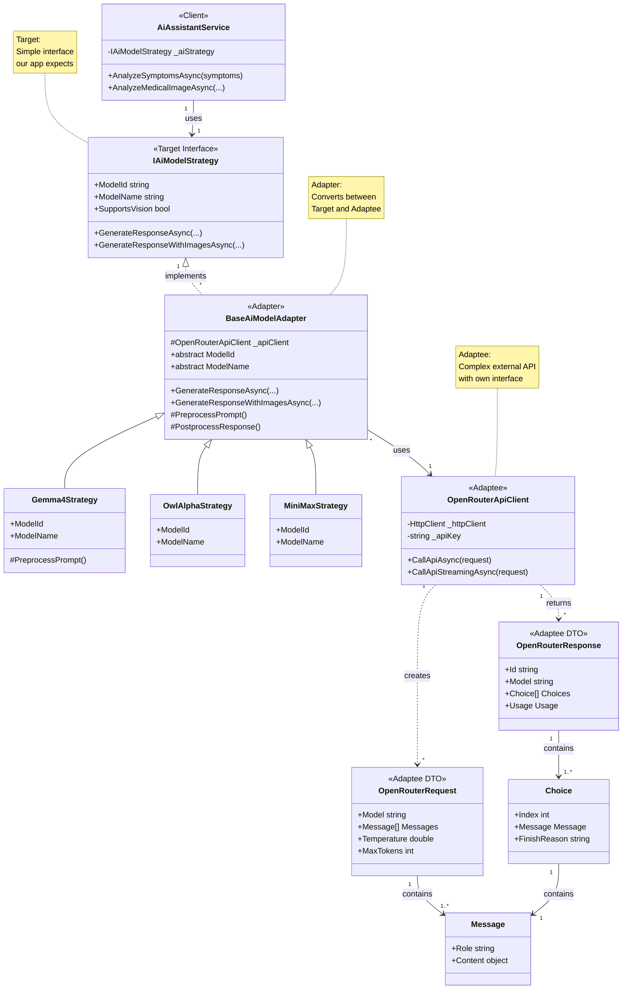

### iv. Other UML Notations (Sequence Diagram)

**Adapter Pattern in Action:**

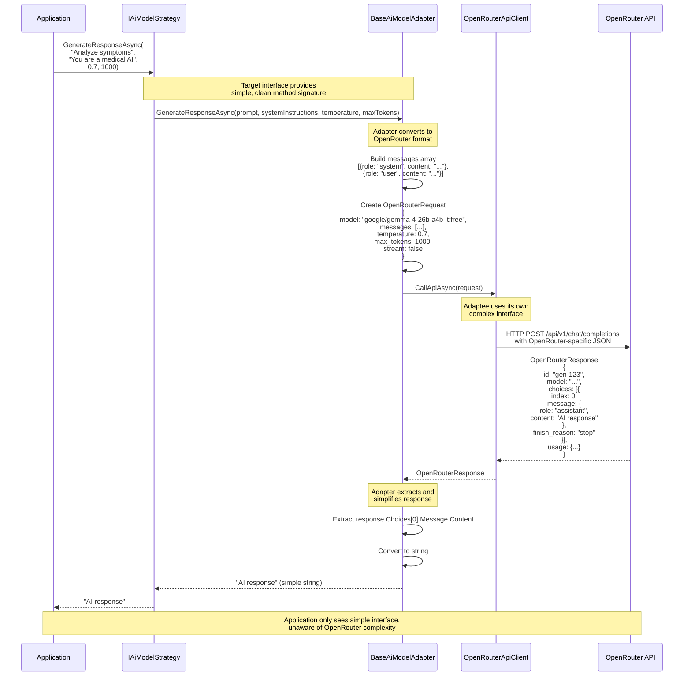

**Multimodal Adaptation (Image Support):**

```mermaid
sequenceDiagram
    participant App as Application
    participant Adapter as BaseAiModelAdapter
    participant Adaptee as OpenRouterApiClient
    participant API as OpenRouter API
    
    App->>Adapter: GenerateResponseWithImagesAsync(<br/>"Analyze this X-ray",<br/>[imageBase64],<br/>"You are a radiologist",<br/>0.7, 1000)
    
    Note over Adapter: Adapter converts to<br/>multimodal format
    
    Adapter->>Adapter: Build multimodal content<br/>[<br/>  {type: "text", text: "Analyze this X-ray"},<br/>  {type: "image_url", image_url: {<br/>    url: "data:image/jpeg;base64,..."<br/>  }}<br/>]
    
    Adapter->>Adapter: Create messages array<br/>[<br/>  {role: "system", content: "You are a radiologist"},<br/>  {role: "user", content: [multimodal content]}<br/>]
    
    Adapter->>Adaptee: CallApiAsync(request)
    
    Adaptee->>API: HTTP POST with multimodal JSON
    
    API-->>Adaptee: OpenRouterResponse
    
    Adaptee-->>Adapter: OpenRouterResponse
    
    Adapter->>Adapter: Extract text response
    
    Adapter-->>App: "X-ray analysis result"
    
    Note over App,API: Application uses simple interface<br/>for complex multimodal requests
```

### v. Sample Potential Code

```csharp
using System;
using System.Collections.Generic;
using System.Linq;
using System.Threading.Tasks;

namespace ai_clinic.Services.AI;

/// <summary>
/// Target Interface - What our application expects
/// 目标接口 - 我们的应用程序期望的接口
/// </summary>
public interface IAiModelStrategy
{
    string ModelId { get; }
    string ModelName { get; }
    bool SupportsVision { get; }
    
    // Simple, clean interface
    Task<string> GenerateResponseAsync(
        string prompt,
        string? systemInstructions = null,
        double temperature = 0.7,
        int maxTokens = 1000
    );
    
    Task<string> GenerateResponseWithImagesAsync(
        string prompt,
        List<string> imageBase64List,
        string? systemInstructions = null,
        double temperature = 0.7,
        int maxTokens = 1000
    );
}

/// <summary>
/// Adapter - Converts OpenRouter API to our unified interface
/// 适配器 - 将OpenRouter API转换为我们的统一接口
/// 
/// This is the Adapter in the Adapter pattern that:
/// 1. Implements the Target interface (IAiModelStrategy)
/// 2. Holds a reference to the Adaptee (OpenRouterApiClient)
/// 3. Converts between incompatible interfaces
/// </summary>
public abstract class BaseAiModelAdapter : IAiModelStrategy
{
    protected readonly OpenRouterApiClient _apiClient; // Reference to Adaptee

    public abstract string ModelId { get; }
    public abstract string ModelName { get; }
    public virtual bool SupportsVision => false;

    protected BaseAiModelAdapter(OpenRouterApiClient apiClient)
    {
        _apiClient = apiClient ?? throw new ArgumentNullException(nameof(apiClient));
    }

    /// <summary>
    /// Adapts our simple interface to OpenRouter's complex API
    /// 将我们的简单接口适配到OpenRouter的复杂API
    /// </summary>
    public virtual async Task<string> GenerateResponseAsync(
        string prompt,
        string? systemInstructions = null,
        double temperature = 0.7,
        int maxTokens = 1000)
    {
        if (string.IsNullOrWhiteSpace(prompt))
            throw new ArgumentException("Prompt cannot be empty", nameof(prompt));

        // STEP 1: Convert our simple parameters to OpenRouter's message format
        var messages = new List<Message>();

        if (!string.IsNullOrWhiteSpace(systemInstructions))
        {
            messages.Add(new Message
            {
                Role = "system",
                Content = systemInstructions
            });
        }

        messages.Add(new Message
        {
            Role = "user",
            Content = prompt
        });

        // STEP 2: Create OpenRouter-specific request object
        var request = new OpenRouterRequest
        {
            Model = ModelId,
            Messages = messages.ToArray(),
            Temperature = temperature,
            MaxTokens = maxTokens,
            Stream = false
        };

        // STEP 3: Call the Adaptee (OpenRouter API)
        var response = await _apiClient.CallApiAsync(request);

        // STEP 4: Convert OpenRouter's complex response to simple string
        if (response.Choices == null || response.Choices.Length == 0)
            throw new InvalidOperationException("No response from AI model");

        var content = response.Choices[0].Message?.Content;
        if (content is string textContent)
        {
            return textContent; // Return simple string
        }

        throw new InvalidOperationException("Empty response from AI model");
    }

    /// <summary>
    /// Adapts multimodal requests (text + images) to OpenRouter format
    /// 将多模态请求（文本+图片）适配到OpenRouter格式
    /// </summary>
    public virtual async Task<string> GenerateResponseWithImagesAsync(
        string prompt,
        List<string> imageBase64List,
        string? systemInstructions = null,
        double temperature = 0.7,
        int maxTokens = 1000)
    {
        if (!SupportsVision)
            throw new NotSupportedException(
                $"Model {ModelName} does not support vision/image input");

        if (string.IsNullOrWhiteSpace(prompt))
            throw new ArgumentException("Prompt cannot be empty", nameof(prompt));

        // STEP 1: Build messages array
        var messages = new List<Message>();

        if (!string.IsNullOrWhiteSpace(systemInstructions))
        {
            messages.Add(new Message
            {
                Role = "system",
                Content = systemInstructions
            });
        }

        // STEP 2: Build multimodal content (text + images)
        var contentParts = new List<ContentPart>
        {
            new ContentPart
            {
                Type = "text",
                Text = prompt
            }
        };

        // Add images in OpenRouter format
        foreach (var imageBase64 in imageBase64List)
        {
            contentParts.Add(new ContentPart
            {
                Type = "image_url",
                ImageUrl = new ImageUrl
                {
                    Url = $"data:image/jpeg;base64,{imageBase64}"
                }
            });
        }

        messages.Add(new Message
        {
            Role = "user",
            Content = contentParts.ToArray() // Content is array of parts
        });

        // STEP 3: Create request
        var request = new OpenRouterRequest
        {
            Model = ModelId,
            Messages = messages.ToArray(),
            Temperature = temperature,
            MaxTokens = maxTokens,
            Stream = false
        };

        // STEP 4: Call API
        var response = await _apiClient.CallApiAsync(request);

        // STEP 5: Extract simple string response
        if (response.Choices == null || response.Choices.Length == 0)
            throw new InvalidOperationException("No response from AI model");

        var content = response.Choices[0].Message?.Content;
        if (content is string textContent)
        {
            return textContent;
        }

        throw new InvalidOperationException("Empty response from AI model");
    }

    /// <summary>
    /// Hook for model-specific preprocessing
    /// 模型特定预处理的钩子方法
    /// </summary>
    protected virtual string PreprocessPrompt(string prompt)
    {
        return prompt;
    }

    /// <summary>
    /// Hook for model-specific postprocessing
    /// 模型特定后处理的钩子方法
    /// </summary>
    protected virtual string PostprocessResponse(string response)
    {
        return response;
    }
}

/// <summary>
/// Adaptee - The external OpenRouter API client
/// 被适配者 - 外部OpenRouter API客户端
/// 
/// This has its own interface that is incompatible with our application
/// </summary>
public class OpenRouterApiClient
{
    private readonly HttpClient _httpClient;
    private readonly string _apiKey;
    private const string BaseUrl = "https://openrouter.ai/api/v1";

    public OpenRouterApiClient(HttpClient httpClient, IConfiguration configuration)
    {
        _httpClient = httpClient;
        _apiKey = configuration["OpenRouter:ApiKey"] 
            ?? throw new InvalidOperationException("OpenRouter API key not configured");
        
        _httpClient.DefaultRequestHeaders.Clear();
        _httpClient.DefaultRequestHeaders.Add("Authorization", $"Bearer {_apiKey}");
        _httpClient.DefaultRequestHeaders.Add("HTTP-Referer", "https://ai-clinic.app");
        _httpClient.DefaultRequestHeaders.Add("X-Title", "AI Clinic");
    }

    /// <summary>
    /// OpenRouter's native API method - complex interface
    /// OpenRouter的原生API方法 - 复杂接口
    /// </summary>
    public async Task<OpenRouterResponse> CallApiAsync(OpenRouterRequest request)
    {
        const string endpoint = "https://openrouter.ai/api/v1/chat/completions";
        
        Console.WriteLine($"[API] Calling OpenRouter with model: {request.Model}");
        
        var response = await _httpClient.PostAsJsonAsync(endpoint, request);
        
        if (!response.IsSuccessStatusCode)
        {
            var errorContent = await response.Content.ReadAsStringAsync();
            throw new HttpRequestException(
                $"OpenRouter API returned {response.StatusCode}: {errorContent}");
        }
        
        var result = await response.Content.ReadFromJsonAsync<OpenRouterResponse>();
        
        if (result == null)
            throw new InvalidOperationException("Failed to deserialize OpenRouter response");
        
        return result;
    }

    /// <summary>
    /// Streaming API call
    /// </summary>
    public async IAsyncEnumerable<string> CallApiStreamingAsync(OpenRouterRequest request)
    {
        const string endpoint = "https://openrouter.ai/api/v1/chat/completions";
        
        request.Stream = true;

        var response = await _httpClient.PostAsJsonAsync(endpoint, request);
        
        if (!response.IsSuccessStatusCode)
            throw new HttpRequestException($"OpenRouter API returned {response.StatusCode}");

        using var stream = await response.Content.ReadAsStreamAsync();
        using var reader = new StreamReader(stream);

        while (!reader.EndOfStream)
        {
            var line = await reader.ReadLineAsync();
            
            if (string.IsNullOrWhiteSpace(line) || !line.StartsWith("data: "))
                continue;

            var data = line.Substring(6);
            
            if (data == "[DONE]")
                break;

            try
            {
                var chunk = JsonSerializer.Deserialize<StreamingChunk>(data);
                var content = chunk?.Choices?[0]?.Delta?.Content;
                
                if (!string.IsNullOrEmpty(content))
                    yield return content;
            }
            catch (JsonException)
            {
                // Skip malformed chunks
            }
        }
    }
}

// OpenRouter-specific DTOs (Adaptee's data structures)
public class OpenRouterRequest
{
    [JsonPropertyName("model")]
    public string Model { get; set; } = string.Empty;

    [JsonPropertyName("messages")]
    public Message[] Messages { get; set; } = Array.Empty<Message>();

    [JsonPropertyName("temperature")]
    public double? Temperature { get; set; }

    [JsonPropertyName("max_tokens")]
    public int? MaxTokens { get; set; }

    [JsonPropertyName("stream")]
    public bool Stream { get; set; } = false;
}

public class OpenRouterResponse
{
    [JsonPropertyName("id")]
    public string Id { get; set; } = string.Empty;

    [JsonPropertyName("model")]
    public string Model { get; set; } = string.Empty;

    [JsonPropertyName("choices")]
    public Choice[] Choices { get; set; } = Array.Empty<Choice>();

    [JsonPropertyName("usage")]
    public Usage? Usage { get; set; }
}

public class Message
{
    [JsonPropertyName("role")]
    public string Role { get; set; } = string.Empty;

    [JsonPropertyName("content")]
    public object? Content { get; set; } // Can be string or ContentPart[]
}

public class Choice
{
    [JsonPropertyName("index")]
    public int Index { get; set; }

    [JsonPropertyName("message")]
    public Message? Message { get; set; }

    [JsonPropertyName("finish_reason")]
    public string? FinishReason { get; set; }
}

// Concrete Adapter Example
public class Gemma4Strategy : BaseAiModelAdapter
{
    public override string ModelId => "google/gemma-4-26b-a4b-it:free";
    public override string ModelName => "Google Gemma 4 26B (Free)";

    public Gemma4Strategy(OpenRouterApiClient apiClient) : base(apiClient)
    {
    }

    protected override string PreprocessPrompt(string prompt)
    {
        // Gemma-specific preprocessing if needed
        return base.PreprocessPrompt(prompt);
    }

    protected override string PostprocessResponse(string response)
    {
        // Gemma-specific postprocessing if needed
        return base.PostprocessResponse(response);
    }
}

// Usage Example
public class AiAssistantService
{
    private readonly IAiModelStrategy _aiStrategy;

    public AiAssistantService(IAiModelStrategy aiStrategy)
    {
        _aiStrategy = aiStrategy;
    }

    public async Task<string> AnalyzeSymptomsAsync(string symptoms)
    {
        // Application uses simple, clean interface
        // Unaware of OpenRouter's complexity
        var response = await _aiStrategy.GenerateResponseAsync(
            prompt: symptoms,
            systemInstructions: "You are a medical AI assistant",
            temperature: 0.7,
            maxTokens: 1500
        );

        return response; // Simple string response
    }

    public async Task<string> AnalyzeMedicalImageAsync(
        string description, 
        byte[] imageData)
    {
        // Convert image to base64
        var imageBase64 = Convert.ToBase64String(imageData);

        // Application uses simple interface for complex multimodal request
        var response = await _aiStrategy.GenerateResponseWithImagesAsync(
            prompt: description,
            imageBase64List: new List<string> { imageBase64 },
            systemInstructions: "You are a radiologist",
            temperature: 0.7,
            maxTokens: 1000
        );

        return response;
    }
}
```

**Comparison: Without Adapter vs With Adapter**

```csharp
// WITHOUT ADAPTER - Application must handle OpenRouter complexity
public class AiServiceWithoutAdapter
{
    private readonly OpenRouterApiClient _apiClient;

    public async Task<string> AnalyzeSymptomsAsync(string symptoms)
    {
        // Application must know OpenRouter's message format
        var messages = new Message[]
        {
            new Message 
            { 
                Role = "system", 
                Content = "You are a medical AI assistant" 
            },
            new Message 
            { 
                Role = "user", 
                Content = symptoms 
            }
        };

        // Application must know OpenRouter's request structure
        var request = new OpenRouterRequest
        {
            Model = "google/gemma-4-26b-a4b-it:free",
            Messages = messages,
            Temperature = 0.7,
            MaxTokens = 1500,
            Stream = false
        };

        // Application must handle OpenRouter's response structure
        var response = await _apiClient.CallApiAsync(request);
        
        if (response.Choices == null || response.Choices.Length == 0)
            throw new InvalidOperationException("No response");

        var content = response.Choices[0].Message?.Content;
        if (content is string textContent)
            return textContent;

        throw new InvalidOperationException("Empty response");
    }
}

// WITH ADAPTER - Application uses simple interface
public class AiServiceWithAdapter
{
    private readonly IAiModelStrategy _aiStrategy;

    public async Task<string> AnalyzeSymptomsAsync(string symptoms)
    {
        // Simple, clean interface - no OpenRouter knowledge required
        return await _aiStrategy.GenerateResponseAsync(
            symptoms,
            "You are a medical AI assistant",
            0.7,
            1500
        );
    }
}
```

### vi. Benefits

1. **Interface Compatibility**
   - Allows incompatible interfaces to work together
   - Application doesn't need to know about OpenRouter's API structure
   - Clean separation between application logic and external API

2. **Simplified Client Code**
   - Client uses simple, intuitive interface
   - No need to construct complex request objects
   - No need to parse complex response structures

3. **Encapsulation of Complexity**
   - OpenRouter's complexity hidden in adapter
   - Message building logic centralized
   - Response parsing logic centralized

4. **Flexibility**
   - Easy to switch to different API providers
   - Can adapt multiple external APIs to same interface
   - Application code remains unchanged when API changes

5. **Reusability**
   - Adapter can be reused across different parts of application
   - Same adapter works for all AI models
   - Reduces code duplication

6. **Maintainability**
   - Changes to OpenRouter API only affect adapter
   - Application code protected from API changes
   - Clear separation of concerns

7. **Testability**
   - Easy to mock `IAiModelStrategy` for testing
   - Can test adapter independently
   - Can test application without calling real API

8. **Extensibility**
   - Easy to add model-specific preprocessing/postprocessing
   - Hook methods (`PreprocessPrompt`, `PostprocessResponse`) for customization
   - Can extend adapter for new features

### vii. Limitations

1. **Additional Abstraction Layer**
   - Adds extra layer between application and API
   - May introduce slight performance overhead
   - More classes to understand and maintain

2. **Limited Access to Adaptee Features**
   - Adapter interface may not expose all Adaptee features
   - Some OpenRouter-specific features may be unavailable
   - May need to extend interface to support new features

3. **Complexity for Simple Cases**
   - May be overkill for simple API integrations
   - Adds complexity when direct API access would suffice
   - More code to write and maintain

4. **Potential Performance Impact**
   - Extra method calls through adapter layer
   - Object creation overhead (request/response objects)
   - May impact performance in high-throughput scenarios

5. **Interface Rigidity**
   - Changing target interface affects all adapters
   - May need to update multiple adapters for interface changes
   - Difficult to add adapter-specific methods

6. **Error Handling Complexity**
   - Must translate Adaptee errors to Target errors
   - May lose error details in translation
   - Difficult to provide meaningful error messages

7. **Debugging Difficulty**
   - Extra layer makes debugging more complex
   - Stack traces longer and harder to follow
   - May need to debug through multiple layers

8. **Maintenance Burden**
   - Must keep adapter synchronized with Adaptee changes
   - API updates require adapter updates
   - Multiple adapters multiply maintenance effort

**Mitigation Strategies:**

- Use comprehensive logging in adapter for debugging
- Provide detailed error messages with context
- Document adapter behavior and limitations
- Use integration tests to verify adapter correctness
- Consider using code generation for repetitive adapter code
- Implement adapter versioning for API changes
- Use dependency injection for easy adapter replacement
- Provide direct API access for advanced use cases

**Comparison with Example Code:**

The codeExample shows a chemical compound adapter (`RichCompound` adapting `ChemicalDatabank`), while this implementation adapts a real external API. Key improvements:

1. **Real-world Integration:** Adapts actual third-party API (OpenRouter) vs academic example
2. **Async Operations:** All methods use async/await for network calls
3. **Complex Data Transformation:** Handles JSON serialization, HTTP requests, multimodal content
4. **Error Handling:** Comprehensive error handling for network failures, API errors
5. **Multiple Adapters:** Provides different adapters for different AI models
6. **Extensibility:** Hook methods for model-specific customization
7. **Production-Ready:** Includes logging, validation, streaming support

**Pattern Combination:**

This implementation combines Adapter and Strategy patterns:
- **Adapter:** Converts OpenRouter API to `IAiModelStrategy` interface
- **Strategy:** Different AI models as interchangeable strategies
- **Result:** Flexible, extensible AI model integration system

---

## Summary

This section provides comprehensive explaination of four design patterns implemented in the AI Clinic application:

1. **Singleton Pattern** - Ensures single database client instance with thread-safe lazy initialization
2. **Facade Pattern** - Simplifies complex subsystem interactions for authentication and patient management
3. **Strategy Pattern** - Enables runtime selection of AI models with unified interface
4. **Adapter Pattern** - Converts OpenRouter API to application-friendly interface

Each pattern is documented with:
- Affected components and classes
- Detailed workflow and data flow descriptions
- Professional Mermaid class and sequence diagrams
- Complete, production-ready code examples
- Comprehensive benefits and limitations analysis
- Mitigation strategies for limitations

These patterns work together to create a maintainable, extensible, and professional codebase that follows SOLID principles and industry best practices.

