# Software Design Concepts and Design Principles

## Table of Contents
1. [Software Design Concepts](#1-software-design-concepts)
   - 1.1 [Abstraction](#11-abstraction)
   - 1.2 [Modularity](#12-modularity)
   - 1.3 [Encapsulation](#13-encapsulation)
   - 1.4 [Functional Independence](#14-functional-independence)
   - 1.5 [Refinement](#15-refinement)
   - 1.6 [Refactoring](#16-refactoring)
   - 1.7 [Architecture](#17-architecture)
   - 1.8 [Patterns](#18-patterns)

2. [Software Design Principles (SOLID)](#2-software-design-principles-solid)
   - 2.1 [Single Responsibility Principle (SRP)](#21-single-responsibility-principle-srp)
   - 2.2 [Open/Closed Principle (OCP)](#22-openclosed-principle-ocp)
   - 2.3 [Liskov Substitution Principle (LSP)](#23-liskov-substitution-principle-lsp)
   - 2.4 [Interface Segregation Principle (ISP)](#24-interface-segregation-principle-isp)
   - 2.5 [Dependency Inversion Principle (DIP)](#25-dependency-inversion-principle-dip)

---

## 1. Software Design Concepts

### 1.1 Abstraction

**Definition:** The process of hiding complex implementation details and showing only the essential features of an object or system.

**Purpose:** Reduce complexity by focusing on what an object does rather than how it does it.

**Implementation in AI Clinic:**

#### Example 1: Facade Pattern - High-Level Abstraction

```csharp
// Complex subsystem operations hidden behind simple interface
public class PatientFacade
{
    private readonly PatientProfileService _patientProfileService;
    private readonly ConversationService _conversationService;
    private readonly MedicalRecordService _medicalRecordService;
    private readonly PrescriptionService _prescriptionService;
    private readonly ActivityLogService _activityLogService;
    
    // ✅ ABSTRACTION: Complex operations abstracted to simple method
    public async Task<PatientDashboardData> GetDashboardDataAsync(Guid userId)
    {
        // Internal complexity hidden:
        // - Parallel service calls
        // - Data aggregation
        // - Activity logging
        // - Error handling
        
        var profileTask = _patientProfileService.GetByUserIdAsync(userId);
        var conversationsTask = _conversationService.GetByPatientIdAsync(userId);
        var recordsTask = _medicalRecordService.GetByPatientIdAsync(userId);
        var prescriptionsTask = _prescriptionService.GetByPatientIdAsync(userId);

        await Task.WhenAll(profileTask, conversationsTask, recordsTask, prescriptionsTask);

        await _activityLogService.LogActivityAsync(userId, "ViewDashboard");

        return new PatientDashboardData
        {
            Profile = await profileTask,
            RecentConversations = (await conversationsTask).Take(3).ToList(),
            MedicalRecords = await recordsTask,
            ActivePrescriptions = (await prescriptionsTask).Where(p => p.IsActive).ToList()
        };
    }
}

// Client uses simple abstraction
public class PatientDashboardPage
{
    private readonly PatientFacade _facade;
    
    protected override async Task OnInitializedAsync()
    {
        // ✅ Simple call - complexity abstracted away
        dashboardData = await _facade.GetDashboardDataAsync(userId);
    }
}
```

#### Example 2: Adapter Pattern - Interface Abstraction

```csharp
// Complex OpenRouter API abstracted to simple interface
public interface IAiModelStrategy
{
    // ✅ ABSTRACTION: Simple, clean interface
    Task<string> GenerateResponseAsync(
        string prompt,
        string? systemInstructions = null,
        double temperature = 0.7,
        int maxTokens = 1000
    );
}

// Complex implementation hidden in adapter
public abstract class BaseAiModelAdapter : IAiModelStrategy
{
    public virtual async Task<string> GenerateResponseAsync(...)
    {
        // Complex operations abstracted:
        // - Build message array
        // - Create request object
        // - Make HTTP call
        // - Parse JSON response
        // - Extract content
        
        var messages = BuildMessages(prompt, systemInstructions);
        var request = CreateRequest(messages, temperature, maxTokens);
        var response = await _apiClient.CallApiAsync(request);
        return ExtractContent(response);
    }
}

// Client uses simple abstraction
public class AiAssistantService
{
    private readonly IAiModelStrategy _strategy;
    
    public async Task<string> AnalyzeSymptoms(string symptoms)
    {
        // ✅ Simple call - OpenRouter complexity abstracted
        return await _strategy.GenerateResponseAsync(symptoms);
    }
}
```

**UML Diagram - Abstraction:**

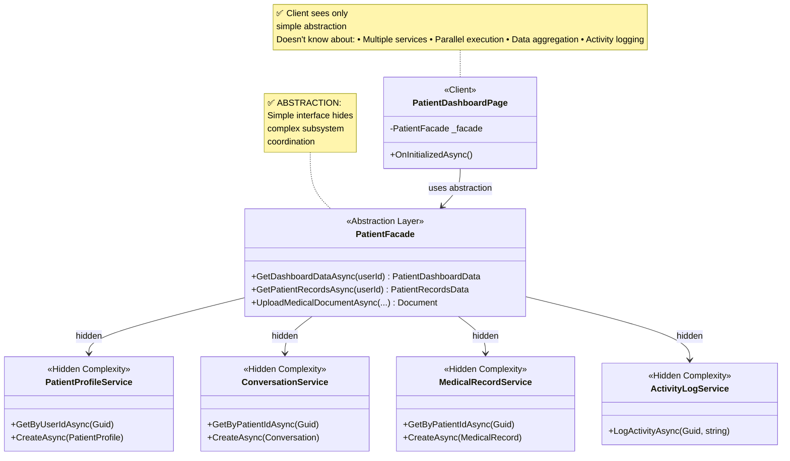

**Benefits:**
- Reduces complexity for clients
- Hides implementation details
- Provides clear, simple interfaces
- Easier to understand and use
- Changes to implementation don't affect clients

**Key Characteristics:**
- Focus on "what" not "how"
- Essential features exposed
- Implementation details hidden
- Simplified interface for complex systems

---

### 1.2 Modularity

**Definition:** The degree to which a system's components can be separated and recombined. A modular system is composed of discrete, independent modules.

**Purpose:** Enable independent development, testing, and maintenance of system components.

**Implementation in AI Clinic:**

#### Example 1: Service Layer Modularity

```csharp
// Each service is an independent module
public class PatientProfileService
{
    // ✅ MODULARITY: Self-contained module for patient profiles
    public async Task<PatientProfile?> GetByUserIdAsync(Guid userId)
    {
        using var db = DbClient.Instance.GetDb();
        return await db.PatientProfiles.FirstOrDefaultAsync(p => p.UserId == userId);
    }
    
    public async Task<PatientProfile> CreateAsync(PatientProfile profile)
    {
        using var db = DbClient.Instance.GetDb();
        db.PatientProfiles.Add(profile);
        await db.SaveChangesAsync();
        return profile;
    }
}

// Separate, independent module for conversations
public class ConversationService
{
    // ✅ MODULARITY: Self-contained module for conversations
    public async Task<List<Conversation>> GetByPatientIdAsync(Guid patientId)
    {
        using var db = DbClient.Instance.GetDb();
        return await db.Conversations
            .Where(c => c.PatientId == patientId)
            .ToListAsync();
    }
    
    public async Task<Conversation> CreateAsync(Conversation conversation)
    {
        using var db = DbClient.Instance.GetDb();
        db.Conversations.Add(conversation);
        await db.SaveChangesAsync();
        return conversation;
    }
}

// Another independent module for medical records
public class MedicalRecordService
{
    // ✅ MODULARITY: Self-contained module for medical records
    public async Task<List<MedicalRecord>> GetByPatientIdAsync(Guid patientId)
    {
        using var db = DbClient.Instance.GetDb();
        return await db.MedicalRecords
            .Where(r => r.PatientId == patientId)
            .ToListAsync();
    }
}
```

#### Example 2: Strategy Pattern - Modular AI Models

```csharp
// Each AI model strategy is an independent module
public class Gemma4Strategy : BaseAiModelAdapter
{
    // ✅ MODULARITY: Self-contained module for Gemma 4
    public override string ModelId => "google/gemma-4-26b-a4b-it:free";
    public override string ModelName => "Google Gemma 4 26B (Free)";
    
    protected override string PreprocessPrompt(string prompt)
    {
        // Gemma-specific logic contained in this module
        return base.PreprocessPrompt(prompt);
    }
}

// Independent module for Owl Alpha
public class OwlAlphaStrategy : BaseAiModelAdapter
{
    // ✅ MODULARITY: Self-contained module for Owl Alpha
    public override string ModelId => "openrouter/owl-alpha";
    public override string ModelName => "OpenRouter Owl Alpha (Free)";
}

// Independent module for MiniMax
public class MiniMaxStrategy : BaseAiModelAdapter
{
    // ✅ MODULARITY: Self-contained module for MiniMax
    public override string ModelId => "minimax/minimax-01";
    public override string ModelName => "MiniMax";
}
```

**UML Diagram - Modularity:**

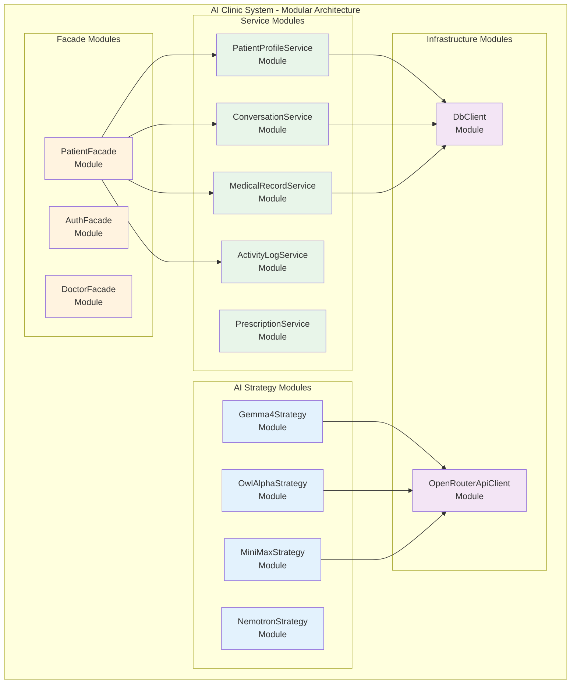

**Benefits:**
- Independent development and testing
- Easy to replace or update modules
- Parallel development by different teams
- Reduced complexity through separation
- Reusable modules across projects

**Key Characteristics:**
- Self-contained components
- Well-defined interfaces
- Minimal dependencies between modules
- Can be developed, tested, and deployed independently

---


### 1.3 Encapsulation

**Definition:** The bundling of data and methods that operate on that data within a single unit, while hiding internal implementation details from the outside world.

**Purpose:** Protect object integrity by preventing external access to internal state and implementation details.

**Implementation in AI Clinic:**

#### Example 1: Singleton Pattern - Encapsulated Database Access

```csharp
public sealed class DbClient
{
    // ✅ ENCAPSULATION: Private instance - hidden from outside
    private static readonly Lazy<DbClient> _instance = 
        new Lazy<DbClient>(() => new DbClient());
    
    // ✅ ENCAPSULATION: Private connection string - internal detail
    private readonly string _connectionString;

    // ✅ ENCAPSULATION: Private constructor - prevents external instantiation
    private DbClient()
    {
        _connectionString = "Data Source=ai-clinic.db";
    }

    // ✅ ENCAPSULATION: Public interface - controlled access
    public static DbClient Instance => _instance.Value;
    
    // ✅ ENCAPSULATION: Public method - exposes functionality, hides implementation
    public AiClinicDbContext GetDb()
    {
        // Internal implementation hidden
        var options = new DbContextOptionsBuilder<AiClinicDbContext>()
            .UseSqlite(_connectionString)
            .Options;
            
        return new AiClinicDbContext(options);
    }
}

// Client cannot access internal details
var db = DbClient.Instance.GetDb();  // ✅ Can only use public interface
// var connStr = DbClient._connectionString;  // ❌ Compile error - private
// var instance = new DbClient();  // ❌ Compile error - private constructor
```

#### Example 2: Adapter Pattern - Encapsulated Complexity

```csharp
public abstract class BaseAiModelAdapter : IAiModelStrategy
{
    // ✅ ENCAPSULATION: Protected field - hidden from clients
    protected readonly OpenRouterApiClient _apiClient;
    
    // ✅ ENCAPSULATION: Public interface - simple and clean
    public virtual async Task<string> GenerateResponseAsync(
        string prompt,
        string? systemInstructions = null,
        double temperature = 0.7,
        int maxTokens = 1000)
    {
        // ✅ ENCAPSULATION: Complex implementation hidden
        var messages = BuildMessages(prompt, systemInstructions);
        var request = CreateRequest(messages, temperature, maxTokens);
        var response = await _apiClient.CallApiAsync(request);
        return ExtractContent(response);
    }
    
    // ✅ ENCAPSULATION: Protected methods - internal implementation
    protected virtual Message[] BuildMessages(string prompt, string? systemInstructions)
    {
        // Implementation details hidden from clients
        var messages = new List<Message>();
        if (!string.IsNullOrWhiteSpace(systemInstructions))
        {
            messages.Add(new Message { Role = "system", Content = systemInstructions });
        }
        messages.Add(new Message { Role = "user", Content = prompt });
        return messages.ToArray();
    }
    
    protected virtual OpenRouterRequest CreateRequest(
        Message[] messages, 
        double temperature, 
        int maxTokens)
    {
        // Implementation details hidden
        return new OpenRouterRequest
        {
            Model = ModelId,
            Messages = messages,
            Temperature = temperature,
            MaxTokens = maxTokens
        };
    }
    
    protected virtual string ExtractContent(OpenRouterResponse response)
    {
        // Implementation details hidden
        if (response.Choices == null || response.Choices.Length == 0)
            throw new InvalidOperationException("No response from AI model");
        
        return response.Choices[0].Message?.Content as string 
            ?? throw new InvalidOperationException("Empty response");
    }
}
```

**UML Diagram - Encapsulation:**

```mermaid
classDiagram
    class DbClient {
        <<Encapsulated>>
        -Lazy~DbClient~ _instance$
        -string _connectionString
        -DbClient()
        +Instance$ DbClient
        +GetDb() AiClinicDbContext
    }
    note for DbClient "✅ ENCAPSULATION:
    
    Private (Hidden):
    • _instance
    • _connectionString
    • Constructor
    
    Public (Exposed):
    • Instance property
    • GetDb() method
    
    Clients cannot access
    internal implementation"
    
    class BaseAiModelAdapter {
        <<Encapsulated>>
        #OpenRouterApiClient _apiClient
        +GenerateResponseAsync(...) string
        #BuildMessages(...) Message[]
        #CreateRequest(...) OpenRouterRequest
        #ExtractContent(...) string
    }
    note for BaseAiModelAdapter "✅ ENCAPSULATION:
    
    Protected (Hidden from clients):
    • _apiClient
    • BuildMessages()
    • CreateRequest()
    • ExtractContent()
    
    Public (Exposed):
    • GenerateResponseAsync()
    
    Complex logic encapsulated"
    
    class PatientFacade {
        <<Encapsulated>>
        -PatientProfileService _profileService
        -ConversationService _conversationService
        -MedicalRecordService _recordService
        +GetDashboardDataAsync(userId) PatientDashboardData
        -AggregateData(...) PatientDashboardData
    }
    note for PatientFacade "✅ ENCAPSULATION:
    
    Private (Hidden):
    • Service dependencies
    • AggregateData() helper
    • Coordination logic
    
    Public (Exposed):
    • GetDashboardDataAsync()
    
    Subsystem complexity
    encapsulated"
    
    class Client {
        <<External>>
        +UseServices()
    }
    
    Client --> DbClient : uses public interface only
    Client --> BaseAiModelAdapter : uses public interface only
    Client --> PatientFacade : uses public interface only
```

**Benefits:**
- Protects object integrity
- Hides implementation details
- Reduces coupling
- Easier to change implementation
- Prevents misuse of internal state

**Key Characteristics:**
- Private/protected fields and methods
- Public interface for external access
- Internal implementation hidden
- Controlled access to data

---

### 1.4 Functional Independence

**Definition:** The degree to which a module performs a single, well-defined function with minimal interaction with other modules.

**Purpose:** Create modules that are self-sufficient and have minimal dependencies, making them easier to understand, test, and maintain.

**Measured by:**
- **Cohesion:** How closely related the responsibilities within a module are (high cohesion is good)
- **Coupling:** How dependent a module is on other modules (low coupling is good)

**Implementation in AI Clinic:**

#### Example 1: High Cohesion - Single Purpose Services

```csharp
// ✅ HIGH COHESION: All methods related to patient profiles
public class PatientProfileService
{
    // All methods work with patient profiles - highly cohesive
    public async Task<PatientProfile?> GetByUserIdAsync(Guid userId) { }
    public async Task<PatientProfile> CreateAsync(PatientProfile profile) { }
    public async Task<PatientProfile> UpdateAsync(PatientProfile profile) { }
    public async Task<bool> DeleteAsync(Guid profileId) { }
}

// ✅ HIGH COHESION: All methods related to activity logging
public class ActivityLogService
{
    // All methods work with activity logs - highly cohesive
    public async Task LogActivityAsync(Guid userId, string action, string? details = null) { }
    public async Task<List<ActivityLog>> GetByUserIdAsync(Guid userId) { }
    public async Task<List<ActivityLog>> GetRecentAsync(int count) { }
}

// ❌ LOW COHESION: Mixed responsibilities (anti-pattern)
public class MixedService
{
    public async Task<PatientProfile> GetPatientProfile(Guid userId) { }
    public async Task<string> GenerateAiResponse(string prompt) { }
    public async Task SendEmail(string to, string subject) { }
    public async Task<List<User>> GetAllUsers() { }
    // ❌ Unrelated methods - low cohesion
}
```

#### Example 2: Low Coupling - Independent Strategies

```csharp
// ✅ LOW COUPLING: Each strategy is independent
public class Gemma4Strategy : BaseAiModelAdapter
{
    // Only depends on base adapter and API client
    // No dependencies on other strategies
    public override string ModelId => "google/gemma-4-26b-a4b-it:free";
    public override string ModelName => "Google Gemma 4 26B";
    
    protected override string PreprocessPrompt(string prompt)
    {
        // Independent implementation
        return base.PreprocessPrompt(prompt);
    }
}

public class OwlAlphaStrategy : BaseAiModelAdapter
{
    // ✅ LOW COUPLING: Independent of Gemma4Strategy
    public override string ModelId => "openrouter/owl-alpha";
    public override string ModelName => "Owl Alpha";
}

// Strategies can be added, removed, or modified independently
```

#### Example 3: Facade Reduces Coupling

```csharp
// ❌ HIGH COUPLING: Client depends on many services
public class PatientDashboardPageWithoutFacade
{
    private readonly PatientProfileService _profileService;
    private readonly ConversationService _conversationService;
    private readonly MedicalRecordService _recordService;
    private readonly PrescriptionService _prescriptionService;
    private readonly ActivityLogService _activityLogService;
    
    // Client must coordinate all services - high coupling
}

// ✅ LOW COUPLING: Client depends only on facade
public class PatientDashboardPageWithFacade
{
    private readonly PatientFacade _facade;  // Single dependency
    
    protected override async Task OnInitializedAsync()
    {
        // ✅ Low coupling - only depends on facade
        dashboardData = await _facade.GetDashboardDataAsync(userId);
    }
}
```

**UML Diagram - Functional Independence:**

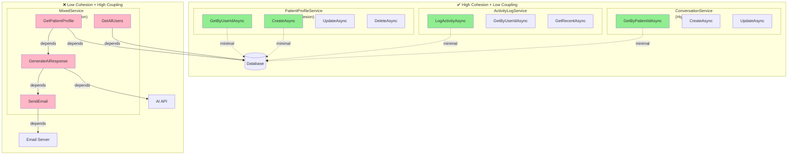

**Cohesion and Coupling Matrix:**

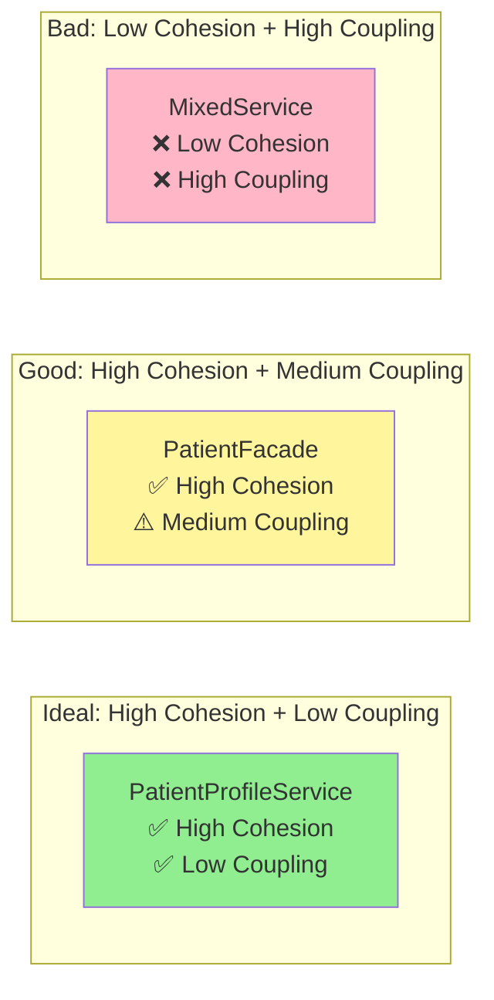

**Benefits:**
- Easier to understand and maintain
- Easier to test in isolation
- Changes don't ripple through system
- Modules can be reused
- Parallel development possible

**Key Characteristics:**
- **High Cohesion:** Related functionality grouped together
- **Low Coupling:** Minimal dependencies on other modules
- **Single Purpose:** Each module does one thing well
- **Clear Interfaces:** Well-defined boundaries between modules

---


### 1.5 Refinement

**Definition:** The process of elaborating and adding detail to a design through successive iterations, moving from abstract concepts to concrete implementations.

**Purpose:** Develop software incrementally, starting with high-level abstractions and progressively adding detail.

**Implementation in AI Clinic:**

#### Refinement Process - From Abstract to Concrete

**Level 1: High-Level Abstraction**
```csharp
// Initial abstract concept: "AI assistance for medical consultations"
public interface IAiAssistance
{
    Task<string> GetMedicalAdvice(string symptoms);
}
```

**Level 2: Refined to Strategy Pattern**
```csharp
// Refined: Multiple AI models with strategy pattern
public interface IAiModelStrategy
{
    string ModelId { get; }
    string ModelName { get; }
    Task<string> GenerateResponseAsync(string prompt, string? systemInstructions = null);
}
```

**Level 3: Further Refined with Adapter**
```csharp
// Further refined: Adapter pattern for external API integration
public abstract class BaseAiModelAdapter : IAiModelStrategy
{
    protected readonly OpenRouterApiClient _apiClient;
    
    public virtual async Task<string> GenerateResponseAsync(
        string prompt,
        string? systemInstructions = null,
        double temperature = 0.7,
        int maxTokens = 1000)
    {
        var messages = BuildMessages(prompt, systemInstructions);
        var request = CreateRequest(messages, temperature, maxTokens);
        var response = await _apiClient.CallApiAsync(request);
        return ExtractContent(response);
    }
    
    protected virtual Message[] BuildMessages(string prompt, string? systemInstructions) { }
    protected virtual OpenRouterRequest CreateRequest(Message[] messages, double temperature, int maxTokens) { }
    protected virtual string ExtractContent(OpenRouterResponse response) { }
}
```

**Level 4: Concrete Implementations**
```csharp
// Concrete implementation 1: Gemma 4
public class Gemma4Strategy : BaseAiModelAdapter
{
    public override string ModelId => "google/gemma-4-26b-a4b-it:free";
    public override string ModelName => "Google Gemma 4 26B (Free)";
    
    protected override string PreprocessPrompt(string prompt)
    {
        // Model-specific refinement
        return base.PreprocessPrompt(prompt);
    }
}

// Concrete implementation 2: Owl Alpha
public class OwlAlphaStrategy : BaseAiModelAdapter
{
    public override string ModelId => "openrouter/owl-alpha";
    public override string ModelName => "OpenRouter Owl Alpha (Free)";
}

// Concrete implementation 3: MiniMax
public class MiniMaxStrategy : BaseAiModelAdapter
{
    public override string ModelId => "minimax/minimax-01";
    public override string ModelName => "MiniMax";
}
```

**Refinement Diagram:**

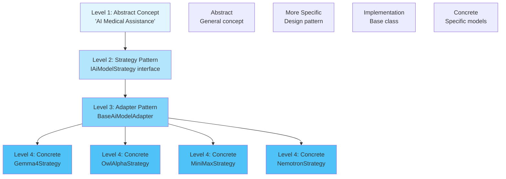

#### Example 2: Patient Management Refinement

**Level 1: Abstract**
```csharp
// Abstract: "Manage patient data"
public interface IPatientManagement
{
    Task<object> GetPatientData(Guid patientId);
}
```

**Level 2: Refined Services**
```csharp
// Refined: Separate services for different concerns
public class PatientProfileService
{
    Task<PatientProfile> GetByUserIdAsync(Guid userId);
}

public class MedicalRecordService
{
    Task<List<MedicalRecord>> GetByPatientIdAsync(Guid patientId);
}

public class PrescriptionService
{
    Task<List<Prescription>> GetByPatientIdAsync(Guid patientId);
}
```

**Level 3: Facade Coordination**
```csharp
// Further refined: Facade coordinates services
public class PatientFacade
{
    private readonly PatientProfileService _profileService;
    private readonly MedicalRecordService _recordService;
    private readonly PrescriptionService _prescriptionService;
    
    public async Task<PatientDashboardData> GetDashboardDataAsync(Guid userId)
    {
        // Coordinated data retrieval
    }
}
```

**Level 4: Specific Operations**
```csharp
// Concrete operations with specific business logic
public class PatientFacade
{
    public async Task<PatientDashboardData> GetDashboardDataAsync(Guid userId)
    {
        var profileTask = _profileService.GetByUserIdAsync(userId);
        var conversationsTask = _conversationService.GetByPatientIdAsync(userId);
        var recordsTask = _recordService.GetByPatientIdAsync(userId);
        var prescriptionsTask = _prescriptionService.GetByPatientIdAsync(userId);

        await Task.WhenAll(profileTask, conversationsTask, recordsTask, prescriptionsTask);

        return new PatientDashboardData
        {
            Profile = await profileTask,
            RecentConversations = (await conversationsTask).Take(3).ToList(),
            MedicalRecords = await recordsTask,
            ActivePrescriptions = (await prescriptionsTask).Where(p => p.IsActive).ToList()
        };
    }
}
```

**Benefits:**
- Incremental development
- Easier to understand progression
- Allows for early validation
- Reduces risk through iteration
- Supports agile development

**Key Characteristics:**
- Top-down approach
- Progressive elaboration
- Each level adds more detail
- Maintains consistency across levels

---

### 1.6 Refactoring

**Definition:** The process of restructuring existing code without changing its external behavior to improve its internal structure, readability, and maintainability.

**Purpose:** Improve code quality, reduce technical debt, and make code easier to understand and modify.

**Implementation in AI Clinic:**

#### Example 1: Extract Method Refactoring

**Before Refactoring:**
```csharp
public class PatientFacade
{
    public async Task<PatientDashboardData> GetDashboardDataAsync(Guid userId)
    {
        // ❌ Long method with multiple responsibilities
        using var db = DbClient.Instance.GetDb();
        
        var profile = await db.PatientProfiles.FirstOrDefaultAsync(p => p.UserId == userId);
        var conversations = await db.Conversations.Where(c => c.PatientId == userId).ToListAsync();
        var records = await db.MedicalRecords.Where(r => r.PatientId == userId).ToListAsync();
        var prescriptions = await db.Prescriptions.Where(p => p.PatientId == userId).ToListAsync();
        
        var recentConversations = conversations.OrderByDescending(c => c.UpdatedAt).Take(3).ToList();
        var activePrescriptions = prescriptions.Where(p => p.IsActive).ToList();
        
        var log = new ActivityLog
        {
            UserId = userId,
            Action = "ViewDashboard",
            Timestamp = DateTime.UtcNow
        };
        db.ActivityLogs.Add(log);
        await db.SaveChangesAsync();
        
        return new PatientDashboardData
        {
            Profile = profile,
            RecentConversations = recentConversations,
            MedicalRecords = records,
            ActivePrescriptions = activePrescriptions
        };
    }
}
```

**After Refactoring:**
```csharp
public class PatientFacade
{
    private readonly PatientProfileService _profileService;
    private readonly ConversationService _conversationService;
    private readonly MedicalRecordService _recordService;
    private readonly PrescriptionService _prescriptionService;
    private readonly ActivityLogService _activityLogService;
    
    // ✅ Refactored: Clear, focused method
    public async Task<PatientDashboardData> GetDashboardDataAsync(Guid userId)
    {
        var profileTask = _profileService.GetByUserIdAsync(userId);
        var conversationsTask = _conversationService.GetByPatientIdAsync(userId);
        var recordsTask = _recordService.GetByPatientIdAsync(userId);
        var prescriptionsTask = _prescriptionService.GetByPatientIdAsync(userId);

        await Task.WhenAll(profileTask, conversationsTask, recordsTask, prescriptionsTask);

        await _activityLogService.LogActivityAsync(userId, "ViewDashboard");

        return new PatientDashboardData
        {
            Profile = await profileTask,
            RecentConversations = (await conversationsTask).Take(3).ToList(),
            MedicalRecords = await recordsTask,
            ActivePrescriptions = (await prescriptionsTask).Where(p => p.IsActive).ToList()
        };
    }
}
```

#### Example 2: Replace Conditional with Polymorphism

**Before Refactoring:**
```csharp
// ❌ Conditional logic for different AI models
public class AiService
{
    public async Task<string> GenerateResponse(string model, string prompt)
    {
        if (model == "owl-alpha")
        {
            // Owl Alpha specific code
            var request = new OpenRouterRequest
            {
                Model = "openrouter/owl-alpha",
                Messages = new[] { new Message { Role = "user", Content = prompt } }
            };
            var response = await _apiClient.CallApiAsync(request);
            return response.Choices[0].Message.Content;
        }
        else if (model == "gemma-4")
        {
            // Gemma 4 specific code
            var request = new OpenRouterRequest
            {
                Model = "google/gemma-4-26b-a4b-it:free",
                Messages = new[] { new Message { Role = "user", Content = prompt } }
            };
            var response = await _apiClient.CallApiAsync(request);
            return response.Choices[0].Message.Content;
        }
        else if (model == "minimax")
        {
            // MiniMax specific code
            var request = new OpenRouterRequest
            {
                Model = "minimax/minimax-01",
                Messages = new[] { new Message { Role = "user", Content = prompt } }
            };
            var response = await _apiClient.CallApiAsync(request);
            return response.Choices[0].Message.Content;
        }
        
        throw new ArgumentException("Unknown model");
    }
}
```

**After Refactoring (Strategy Pattern):**
```csharp
// ✅ Refactored: Polymorphism replaces conditionals
public interface IAiModelStrategy
{
    Task<string> GenerateResponseAsync(string prompt);
}

public class OwlAlphaStrategy : BaseAiModelAdapter
{
    public override string ModelId => "openrouter/owl-alpha";
    public override string ModelName => "Owl Alpha";
}

public class Gemma4Strategy : BaseAiModelAdapter
{
    public override string ModelId => "google/gemma-4-26b-a4b-it:free";
    public override string ModelName => "Gemma 4";
}

public class MiniMaxStrategy : BaseAiModelAdapter
{
    public override string ModelId => "minimax/minimax-01";
    public override string ModelName => "MiniMax";
}

// ✅ Clean usage
public class AiModelContext
{
    private IAiModelStrategy _currentStrategy;
    
    public async Task<string> GenerateResponseAsync(string prompt)
    {
        return await _currentStrategy.GenerateResponseAsync(prompt);
    }
}
```

**Refactoring Types Applied:**

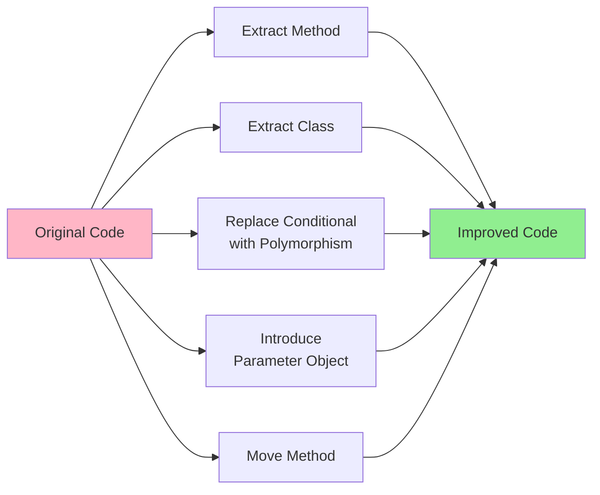

**Benefits:**
- Improved code readability
- Reduced complexity
- Easier to maintain
- Better testability
- Reduced duplication

**Key Characteristics:**
- Preserves external behavior
- Improves internal structure
- Incremental improvements
- Continuous process

---


### 1.7 Architecture

**Definition:** The fundamental organization of a system, embodied in its components, their relationships to each other and the environment, and the principles governing its design and evolution.

**Purpose:** Provide a blueprint for the system that defines its structure, behavior, and key design decisions.

**Implementation in AI Clinic:**

#### Layered Architecture

The AI Clinic application follows a layered architecture pattern with clear separation of concerns:

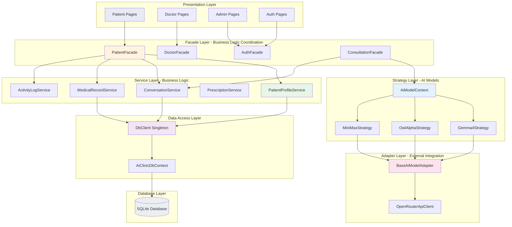

#### Architectural Components

**1. Presentation Layer**
```csharp
// Razor Pages - UI Components
@page "/patient/dashboard"
@inject PatientFacade PatientFacade

@code {
    private PatientDashboardData? dashboardData;
    
    protected override async Task OnInitializedAsync()
    {
        var userId = GetCurrentUserId();
        dashboardData = await PatientFacade.GetDashboardDataAsync(userId);
    }
}
```

**2. Facade Layer**
```csharp
// Coordinates multiple services for high-level operations
public class PatientFacade
{
    private readonly PatientProfileService _profileService;
    private readonly ConversationService _conversationService;
    private readonly MedicalRecordService _recordService;
    
    public async Task<PatientDashboardData> GetDashboardDataAsync(Guid userId)
    {
        // Coordinate multiple services
    }
}
```

**3. Service Layer**
```csharp
// Business logic and data access
public class PatientProfileService
{
    public async Task<PatientProfile?> GetByUserIdAsync(Guid userId)
    {
        using var db = DbClient.Instance.GetDb();
        return await db.PatientProfiles.FirstOrDefaultAsync(p => p.UserId == userId);
    }
}
```

**4. Strategy Layer**
```csharp
// AI model selection and execution
public class AiModelContext
{
    private IAiModelStrategy _currentStrategy;
    
    public async Task<string> GenerateResponseAsync(string prompt)
    {
        return await _currentStrategy.GenerateResponseAsync(prompt);
    }
}
```

**5. Adapter Layer**
```csharp
// External API integration
public abstract class BaseAiModelAdapter : IAiModelStrategy
{
    protected readonly OpenRouterApiClient _apiClient;
    
    public virtual async Task<string> GenerateResponseAsync(...)
    {
        // Adapt to external API
    }
}
```

**6. Data Access Layer**
```csharp
// Database access management
public sealed class DbClient
{
    private static readonly Lazy<DbClient> _instance = 
        new Lazy<DbClient>(() => new DbClient());
    
    public static DbClient Instance => _instance.Value;
    
    public AiClinicDbContext GetDb() { }
}
```

#### Architectural Principles Applied

**Separation of Concerns:**
- Each layer has distinct responsibility
- UI doesn't know about database
- Services don't know about UI

**Dependency Flow:**
- Dependencies flow downward
- Higher layers depend on lower layers
- Lower layers don't know about higher layers

**Loose Coupling:**
- Layers communicate through interfaces
- Easy to replace implementations
- Changes isolated to specific layers

**High Cohesion:**
- Related functionality grouped in same layer
- Each layer has clear purpose
- Minimal overlap between layers

**Benefits:**
- Clear structure and organization
- Easy to understand and navigate
- Supports parallel development
- Facilitates testing at each layer
- Enables technology changes per layer

---

### 1.8 Patterns

**Definition:** Reusable solutions to commonly occurring problems in software design. Design patterns are templates that can be applied to solve similar problems in different contexts.

**Purpose:** Provide proven solutions, improve code quality, and facilitate communication among developers.

**Implementation in AI Clinic:**

The AI Clinic application implements four key design patterns:

#### Pattern 1: Singleton Pattern

**Problem:** Need to ensure only one instance of database client exists throughout application lifecycle.

**Solution:** Singleton pattern with thread-safe lazy initialization.

```csharp
public sealed class DbClient
{
    private static readonly Lazy<DbClient> _instance = 
        new Lazy<DbClient>(() => new DbClient());
    
    private readonly string _connectionString;

    private DbClient()
    {
        _connectionString = "Data Source=ai-clinic.db";
    }

    public static DbClient Instance => _instance.Value;
    
    public AiClinicDbContext GetDb()
    {
        var options = new DbContextOptionsBuilder<AiClinicDbContext>()
            .UseSqlite(_connectionString)
            .Options;
        return new AiClinicDbContext(options);
    }
}
```

**Benefits:**
- Controlled access to single instance
- Thread-safe initialization
- Global access point
- Lazy initialization

#### Pattern 2: Facade Pattern

**Problem:** Complex subsystem with multiple services that need coordination.

**Solution:** Facade pattern provides simplified interface to complex subsystem.

```csharp
public class PatientFacade
{
    private readonly PatientProfileService _profileService;
    private readonly ConversationService _conversationService;
    private readonly MedicalRecordService _recordService;
    private readonly PrescriptionService _prescriptionService;
    private readonly ActivityLogService _activityLogService;
    
    public async Task<PatientDashboardData> GetDashboardDataAsync(Guid userId)
    {
        // Coordinate multiple services
        var profileTask = _profileService.GetByUserIdAsync(userId);
        var conversationsTask = _conversationService.GetByPatientIdAsync(userId);
        var recordsTask = _recordService.GetByPatientIdAsync(userId);
        var prescriptionsTask = _prescriptionService.GetByPatientIdAsync(userId);

        await Task.WhenAll(profileTask, conversationsTask, recordsTask, prescriptionsTask);

        await _activityLogService.LogActivityAsync(userId, "ViewDashboard");

        return new PatientDashboardData
        {
            Profile = await profileTask,
            RecentConversations = (await conversationsTask).Take(3).ToList(),
            MedicalRecords = await recordsTask,
            ActivePrescriptions = (await prescriptionsTask).Where(p => p.IsActive).ToList()
        };
    }
}
```

**Benefits:**
- Simplified interface for clients
- Loose coupling between UI and services
- Centralized coordination logic
- Parallel execution optimization

#### Pattern 3: Strategy Pattern

**Problem:** Need to select different AI models at runtime without changing client code.

**Solution:** Strategy pattern defines family of algorithms and makes them interchangeable.

```csharp
// Strategy interface
public interface IAiModelStrategy
{
    string ModelId { get; }
    string ModelName { get; }
    Task<string> GenerateResponseAsync(string prompt, ...);
}

// Context
public class AiModelContext
{
    private IAiModelStrategy _currentStrategy;
    private readonly Dictionary<string, IAiModelStrategy> _strategies;
    
    public void SetStrategy(string strategyKey)
    {
        _currentStrategy = _strategies[strategyKey];
    }
    
    public async Task<string> GenerateResponseAsync(string prompt)
    {
        return await _currentStrategy.GenerateResponseAsync(prompt);
    }
}

// Concrete strategies
public class Gemma4Strategy : BaseAiModelAdapter
{
    public override string ModelId => "google/gemma-4-26b-a4b-it:free";
    public override string ModelName => "Gemma 4";
}

public class OwlAlphaStrategy : BaseAiModelAdapter
{
    public override string ModelId => "openrouter/owl-alpha";
    public override string ModelName => "Owl Alpha";
}
```

**Benefits:**
- Runtime algorithm selection
- Easy to add new AI models
- Eliminates conditional logic
- Open/Closed principle compliance

#### Pattern 4: Adapter Pattern

**Problem:** Need to integrate external OpenRouter API with incompatible interface.

**Solution:** Adapter pattern converts OpenRouter API to application's expected interface.

```csharp
// Target interface (what application expects)
public interface IAiModelStrategy
{
    Task<string> GenerateResponseAsync(string prompt, ...);
}

// Adapter (converts between interfaces)
public abstract class BaseAiModelAdapter : IAiModelStrategy
{
    protected readonly OpenRouterApiClient _apiClient;  // Adaptee
    
    public virtual async Task<string> GenerateResponseAsync(
        string prompt,
        string? systemInstructions = null,
        double temperature = 0.7,
        int maxTokens = 1000)
    {
        // Convert to OpenRouter format
        var messages = BuildMessages(prompt, systemInstructions);
        var request = new OpenRouterRequest
        {
            Model = ModelId,
            Messages = messages,
            Temperature = temperature,
            MaxTokens = maxTokens
        };
        
        // Call adaptee
        var response = await _apiClient.CallApiAsync(request);
        
        // Convert back to simple format
        return ExtractContent(response);
    }
}

// Adaptee (external API with own interface)
public class OpenRouterApiClient
{
    public async Task<OpenRouterResponse> CallApiAsync(OpenRouterRequest request)
    {
        var response = await _httpClient.PostAsJsonAsync(endpoint, request);
        return await response.Content.ReadFromJsonAsync<OpenRouterResponse>();
    }
}
```

**Benefits:**
- Interface compatibility
- Simplified client code
- Encapsulated complexity
- Easy to switch API providers

#### Pattern Relationships

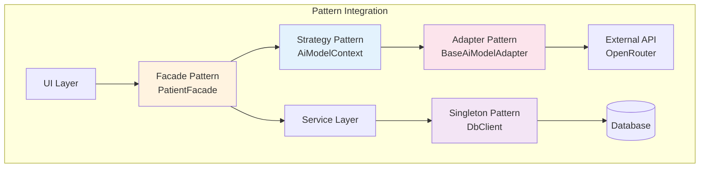

**Benefits of Using Patterns:**
- Proven solutions to common problems
- Improved code quality and maintainability
- Better communication among developers
- Faster development through reuse
- Reduced errors through tested solutions

**Key Characteristics:**
- Reusable design templates
- Language-independent concepts
- Documented best practices
- Facilitate design discussions

---


## 2. Software Design Principles (SOLID)

The SOLID principles are five design principles that make software designs more understandable, flexible, and maintainable.

### 2.1 Single Responsibility Principle (SRP)

**Definition:** A class should have only one reason to change. Each class should have a single, well-defined responsibility.

**Purpose:** Reduce complexity, improve maintainability, and make code easier to understand and test.

**UML Diagram - Single Responsibility:**

```mermaid
classDiagram
    %% Each class has ONE responsibility
    
    class DbClient {
        <<Singleton - Single Responsibility>>
        -Lazy~DbClient~ _instance$
        -string _connectionString
        +Instance$ DbClient
        +GetDb() AiClinicDbContext
    }
    note for DbClient "✅ Single Responsibility:
    ONLY manages database
    connection configuration
    
    Does NOT:
    ❌ Handle business logic
    ❌ Validate data
    ❌ Process queries"
    
    class PatientProfileService {
        <<Service - Single Responsibility>>
        +GetByUserIdAsync(Guid)
        +CreateAsync(PatientProfile)
        +UpdateAsync(PatientProfile)
        +DeleteAsync(Guid)
    }
    note for PatientProfileService "✅ Single Responsibility:
    ONLY manages patient
    profile data access
    
    Does NOT:
    ❌ Handle authentication
    ❌ Send notifications
    ❌ Generate reports"
    
    class ActivityLogService {
        <<Service - Single Responsibility>>
        +LogActivityAsync(Guid, string, string)
        +GetByUserIdAsync(Guid)
        +GetRecentAsync(int)
    }
    note for ActivityLogService "✅ Single Responsibility:
    ONLY manages activity
    logging
    
    Does NOT:
    ❌ Manage user profiles
    ❌ Handle authentication
    ❌ Process business logic"
    
    class Gemma4Strategy {
        <<Strategy - Single Responsibility>>
        +ModelId string
        +ModelName string
        +GenerateResponseAsync(...)
        #PreprocessPrompt(string)
    }
    note for Gemma4Strategy "✅ Single Responsibility:
    ONLY handles Gemma 4
    AI model interactions
    
    Does NOT:
    ❌ Handle other AI models
    ❌ Manage HTTP requests
    ❌ Store data"
    
    class OpenRouterApiClient {
        <<API Client - Single Responsibility>>
        -HttpClient _httpClient
        -string _apiKey
        +CallApiAsync(request)
        +CallApiStreamingAsync(request)
    }
    note for OpenRouterApiClient "✅ Single Responsibility:
    ONLY handles HTTP
    communication with
    OpenRouter API
    
    Does NOT:
    ❌ Format prompts
    ❌ Select AI models
    ❌ Process responses"
    
    %% Relationships showing separation
    PatientProfileService ..> DbClient : uses for data access
    ActivityLogService ..> DbClient : uses for data access
    Gemma4Strategy ..> OpenRouterApiClient : uses for API calls
    
    note for PatientProfileService "Each class has a
    SINGLE reason to change:
    
    • DbClient: DB config changes
    • PatientProfileService: Profile logic changes
    • ActivityLogService: Logging logic changes
    • Gemma4Strategy: Gemma 4 model changes
    • OpenRouterApiClient: API protocol changes"
```

**Implementation Example:**

```csharp
// ✅ SRP: DbClient only manages database connection
public sealed class DbClient
{
    private static readonly Lazy<DbClient> _instance = 
        new Lazy<DbClient>(() => new DbClient());
    
    private readonly string _connectionString;

    private DbClient()
    {
        _connectionString = "Data Source=ai-clinic.db";
    }

    public static DbClient Instance => _instance.Value;
    
    // Single responsibility: Provide database context
    public AiClinicDbContext GetDb()
    {
        var options = new DbContextOptionsBuilder<AiClinicDbContext>()
            .UseSqlite(_connectionString)
            .Options;
        return new AiClinicDbContext(options);
    }
}

// ✅ SRP: PatientProfileService only manages patient profiles
public class PatientProfileService
{
    public async Task<PatientProfile?> GetByUserIdAsync(Guid userId)
    {
        using var db = DbClient.Instance.GetDb();
        return await db.PatientProfiles.FirstOrDefaultAsync(p => p.UserId == userId);
    }
    
    public async Task<PatientProfile> CreateAsync(PatientProfile profile)
    {
        using var db = DbClient.Instance.GetDb();
        db.PatientProfiles.Add(profile);
        await db.SaveChangesAsync();
        return profile;
    }
}

// ✅ SRP: Gemma4Strategy only handles Gemma 4 model
public class Gemma4Strategy : BaseAiModelAdapter
{
    public override string ModelId => "google/gemma-4-26b-a4b-it:free";
    public override string ModelName => "Google Gemma 4 26B (Free)";
    
    protected override string PreprocessPrompt(string prompt)
    {
        return base.PreprocessPrompt(prompt);
    }
}
```

**Benefits:**
- Easier to understand (focused purpose)
- Easier to test (single concern)
- Easier to maintain (isolated changes)
- Reduced coupling
- Better organization

---


### 2.2 Open/Closed Principle (OCP)

**Definition:** Software entities should be open for extension but closed for modification. You should be able to add new functionality without changing existing code.

**Purpose:** Reduce risk of breaking existing functionality when adding new features.

**UML Diagram - Open/Closed Principle:**

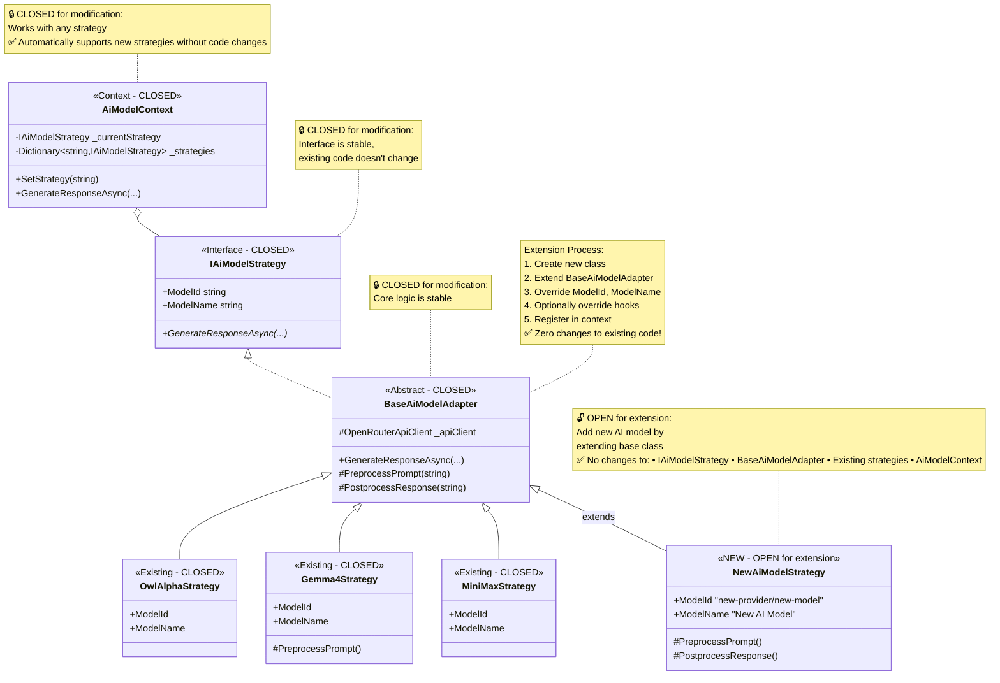

**Implementation Example:**

```csharp
// 🔒 CLOSED: Interface doesn't change
public interface IAiModelStrategy
{
    string ModelId { get; }
    string ModelName { get; }
    Task<string> GenerateResponseAsync(string prompt, ...);
}

// 🔒 CLOSED: Base adapter doesn't change
public abstract class BaseAiModelAdapter : IAiModelStrategy
{
    protected readonly OpenRouterApiClient _apiClient;
    
    public virtual async Task<string> GenerateResponseAsync(...)
    {
        var messages = BuildMessages(prompt, systemInstructions);
        var request = CreateRequest(messages, temperature, maxTokens);
        var response = await _apiClient.CallApiAsync(request);
        return ExtractContent(response);
    }
}

// 🔒 CLOSED: Existing strategies don't change
public class Gemma4Strategy : BaseAiModelAdapter
{
    public override string ModelId => "google/gemma-4-26b-a4b-it:free";
    public override string ModelName => "Gemma 4";
}

// 🔓 OPEN: Add new strategy by extension
public class NewAiModelStrategy : BaseAiModelAdapter
{
    public override string ModelId => "new-provider/new-model";
    public override string ModelName => "New AI Model";
    
    // Optionally override for model-specific behavior
    protected override string PreprocessPrompt(string prompt)
    {
        return $"[NEW] {prompt}";
    }
}

// 🔒 CLOSED: Context works with any strategy
public class AiModelContext
{
    public AiModelContext(OpenRouterApiClient apiClient)
    {
        _availableStrategies = new Dictionary<string, IAiModelStrategy>
        {
            ["owl-alpha"] = new OwlAlphaStrategy(apiClient),
            ["gemma-4"] = new Gemma4Strategy(apiClient),
            // ✅ Add new strategy - no other code changes needed
            ["new-model"] = new NewAiModelStrategy(apiClient)
        };
    }
}
```

**Benefits:**
- Add features without breaking existing code
- Reduced risk of bugs
- Easier to extend
- Supports plugin architecture
- Better maintainability

---

### 2.3 Liskov Substitution Principle (LSP)

**Definition:** Objects of a superclass should be replaceable with objects of its subclasses without breaking the application. Subclasses must be substitutable for their base classes.

**Purpose:** Ensure that inheritance is used correctly and polymorphism works as expected.

**UML Diagram - Liskov Substitution:**

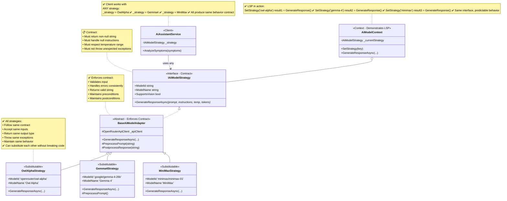

**Implementation Example:**

```csharp
// ✅ LSP: All strategies follow same contract
public abstract class BaseAiModelAdapter : IAiModelStrategy
{
    public virtual async Task<string> GenerateResponseAsync(
        string prompt,
        string? systemInstructions = null,
        double temperature = 0.7,
        int maxTokens = 1000)
    {
        // ✅ Contract: Validate input
        if (string.IsNullOrWhiteSpace(prompt))
            throw new ArgumentException("Prompt cannot be empty");
        
        // ✅ Contract: Handle null instructions
        var messages = BuildMessages(prompt, systemInstructions);
        var request = CreateRequest(messages, temperature, maxTokens);
        var response = await _apiClient.CallApiAsync(request);
        
        // ✅ Contract: Return non-null string
        return ExtractContent(response);
    }
}

// ✅ LSP: Gemma4Strategy follows contract
public class Gemma4Strategy : BaseAiModelAdapter
{
    // ✅ Doesn't violate parent's contract
    // ✅ Can be substituted for BaseAiModelAdapter
    protected override string PreprocessPrompt(string prompt)
    {
        // Extends behavior without breaking contract
        return base.PreprocessPrompt(prompt);
    }
}

// ✅ LSP: Client can use any strategy
public class AiAssistantService
{
    private readonly IAiModelStrategy _strategy;
    
    public async Task<string> AnalyzeSymptoms(string symptoms)
    {
        // ✅ Works with any strategy - they're all substitutable
        return await _strategy.GenerateResponseAsync(symptoms);
    }
}

// ✅ LSP: Runtime substitution
public class AiModelContext
{
    private IAiModelStrategy _currentStrategy;
    
    public void SetStrategy(string key)
    {
        // ✅ Any strategy can be substituted
        _currentStrategy = _availableStrategies[key];
    }
    
    public async Task<string> GenerateResponseAsync(string prompt)
    {
        // ✅ Polymorphic call - works with any strategy
        return await _currentStrategy.GenerateResponseAsync(prompt);
    }
}
```

**Benefits:**
- Predictable behavior across implementations
- Safe polymorphism
- Reliable substitution
- Correct inheritance usage
- Better code reuse

---


### 2.4 Interface Segregation Principle (ISP)

**Definition:** Clients should not be forced to depend on interfaces they don't use. Many specific interfaces are better than one general-purpose interface.

**Purpose:** Prevent classes from having to implement methods they don't need, reducing unnecessary dependencies.

**UML Diagram - Interface Segregation:**

```mermaid
classDiagram
    %% ✅ GOOD: Focused interface
    class IAiModelStrategy {
        <<Focused Interface - ISP✅>>
        +ModelId string
        +ModelName string
        +SupportsVision bool
        +GenerateResponseAsync(...)*
        +GenerateResponseWithImagesAsync(...)*
    }
    note for IAiModelStrategy "✅ ISP Compliant:
    • Only essential methods
    • Clients use what they need
    • Optional features clearly marked
    • No forced dependencies"
    
    %% Client 1: Only needs text generation
    class SimpleAiService {
        <<Client 1 - Text Only>>
        -IAiModelStrategy _strategy
        +Analyze(text) string
    }
    note for SimpleAiService "✅ Uses only:
    • GenerateResponseAsync()
    
    ✅ Doesn't need:
    • Vision methods
    
    ✅ Not forced to implement
    unused methods"
    
    %% Client 2: Needs vision
    class VisionAiService {
        <<Client 2 - Vision>>
        -IAiModelStrategy _strategy
        +AnalyzeImage(text, image) string
    }
    note for VisionAiService "✅ Uses:
    • GenerateResponseAsync()
    • GenerateResponseWithImagesAsync()
    • SupportsVision property
    
    ✅ Checks capability first"
    
    SimpleAiService --> IAiModelStrategy : uses text only
    VisionAiService --> IAiModelStrategy : uses vision
    
    %% Separate facades for different concerns
    class PatientFacade {
        <<Focused Facade - ISP✅>>
        +GetDashboardDataAsync()
        +GetPatientRecordsAsync()
        +UploadMedicalDocumentAsync()
    }
    note for PatientFacade "✅ ISP Compliant:
    Only patient-related
    operations
    
    Does NOT include:
    ❌ Auth methods
    ❌ Doctor methods
    ❌ Admin methods"
    
    class AuthFacade {
        <<Focused Facade - ISP✅>>
        +SignInAsync()
        +SignUpAsync()
        +SignOutAsync()
        +ValidateTokenAsync()
    }
    note for AuthFacade "✅ ISP Compliant:
    Only auth-related
    operations
    
    Does NOT include:
    ❌ Patient methods
    ❌ Doctor methods
    ❌ Admin methods"
    
    class DoctorFacade {
        <<Focused Facade - ISP✅>>
        +GetDoctorDashboardAsync()
        +GetConsultationsAsync()
        +UpdateConsultationAsync()
    }
    note for DoctorFacade "✅ ISP Compliant:
    Only doctor-related
    operations
    
    Does NOT include:
    ❌ Patient methods
    ❌ Auth methods
    ❌ Admin methods"
    
    %% Clients use only what they need
    class PatientDashboardPage {
        <<Client>>
        -PatientFacade _patientFacade
    }
    note for PatientDashboardPage "✅ Only depends on
    PatientFacade
    
    ✅ Not forced to depend on:
    • AuthFacade
    • DoctorFacade
    • AdminFacade"
    
    class SignInPage {
        <<Client>>
        -AuthFacade _authFacade
    }
    note for SignInPage "✅ Only depends on
    AuthFacade
    
    ✅ Not forced to depend on:
    • PatientFacade
    • DoctorFacade
    • AdminFacade"
    
    PatientDashboardPage --> PatientFacade
    SignInPage --> AuthFacade
```

**Implementation Example:**

```csharp
// ✅ ISP: Focused interface with only essential methods
public interface IAiModelStrategy
{
    string ModelId { get; }
    string ModelName { get; }
    bool SupportsVision { get; }
    
    Task<string> GenerateResponseAsync(string prompt, ...);
    Task<string> GenerateResponseWithImagesAsync(string prompt, List<string> images, ...);
}

// ✅ ISP: Client 1 uses only text generation
public class SimpleAiService
{
    private readonly IAiModelStrategy _strategy;
    
    public async Task<string> Analyze(string text)
    {
        // ✅ Only uses text generation - doesn't need vision methods
        return await _strategy.GenerateResponseAsync(text);
    }
}

// ✅ ISP: Client 2 uses vision when needed
public class VisionAiService
{
    private readonly IAiModelStrategy _strategy;
    
    public async Task<string> AnalyzeImage(string text, byte[] image)
    {
        // ✅ Checks capability first
        if (_strategy.SupportsVision)
        {
            var base64 = Convert.ToBase64String(image);
            return await _strategy.GenerateResponseWithImagesAsync(
                text, new List<string> { base64 });
        }
        
        return await _strategy.GenerateResponseAsync(text);
    }
}

// ✅ ISP: Separate facades for different concerns
public class PatientFacade
{
    // Only patient-related methods
    public async Task<PatientDashboardData> GetDashboardDataAsync(Guid userId) { }
    public async Task<PatientRecordsData> GetPatientRecordsAsync(Guid userId) { }
}

public class AuthFacade
{
    // Only auth-related methods
    public async Task<AuthResult> SignInAsync(string email, string password) { }
    public async Task<AuthResult> SignUpAsync(User user, string password) { }
}

// ✅ ISP: Clients depend only on what they need
public class PatientDashboardPage
{
    private readonly PatientFacade _patientFacade;  // ✅ Only patient operations
    
    // ✅ Not forced to depend on AuthFacade, DoctorFacade, etc.
}
```

**Benefits:**
- Smaller, focused interfaces
- Reduced coupling
- Easier to implement
- Easier to test
- Better separation of concerns

---

### 2.5 Dependency Inversion Principle (DIP)

**Definition:** High-level modules should not depend on low-level modules. Both should depend on abstractions. Abstractions should not depend on details. Details should depend on abstractions.

**Purpose:** Reduce coupling between modules and make the system more flexible and easier to change.

**UML Diagram - Dependency Inversion:**

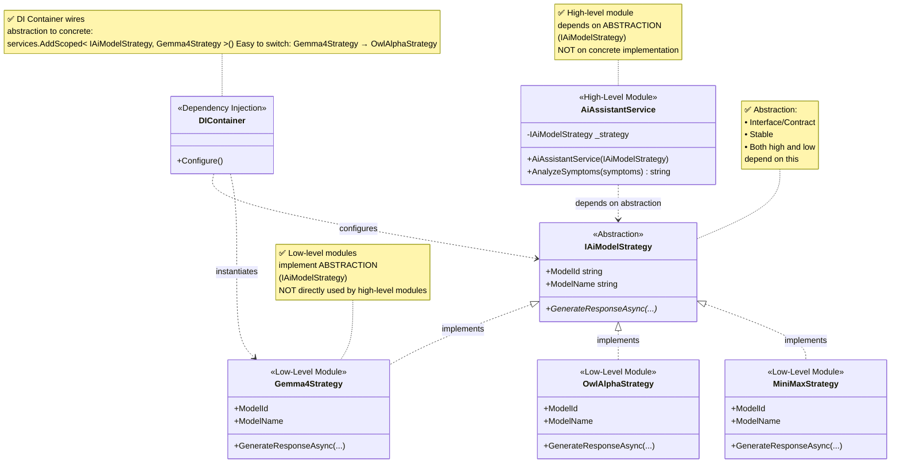

**Implementation Example:**

```csharp
// ✅ DIP: High-level module depends on abstraction
public class AiAssistantService
{
    private readonly IAiModelStrategy _strategy;  // ✅ Abstraction, not concrete
    
    // ✅ DIP: Dependency injected through constructor
    public AiAssistantService(IAiModelStrategy strategy)
    {
        _strategy = strategy;
    }
    
    public async Task<string> AnalyzeSymptoms(string symptoms)
    {
        // ✅ Works with any implementation of IAiModelStrategy
        return await _strategy.GenerateResponseAsync(symptoms);
    }
}

// ✅ DIP: Abstraction (interface)
public interface IAiModelStrategy
{
    Task<string> GenerateResponseAsync(string prompt, ...);
}

// ✅ DIP: Low-level modules implement abstraction
public class Gemma4Strategy : IAiModelStrategy
{
    public async Task<string> GenerateResponseAsync(string prompt, ...)
    {
        // Implementation details
    }
}

public class OwlAlphaStrategy : IAiModelStrategy
{
    public async Task<string> GenerateResponseAsync(string prompt, ...)
    {
        // Implementation details
    }
}

// ✅ DIP: Dependency injection configuration
public class Startup
{
    public void ConfigureServices(IServiceCollection services)
    {
        // ✅ Wire abstraction to concrete implementation
        services.AddScoped<IAiModelStrategy, Gemma4Strategy>();
        
        // Easy to switch:
        // services.AddScoped<IAiModelStrategy, OwlAlphaStrategy>();
        
        services.AddScoped<AiAssistantService>();
    }
}

// ✅ DIP: Facade depends on service abstractions
public class PatientFacade
{
    private readonly IPatientProfileService _profileService;
    private readonly IConversationService _conversationService;
    private readonly IMedicalRecordService _recordService;
    
    // ✅ DIP: Depends on abstractions, not concrete classes
    public PatientFacade(
        IPatientProfileService profileService,
        IConversationService conversationService,
        IMedicalRecordService recordService)
    {
        _profileService = profileService;
        _conversationService = conversationService;
        _recordService = recordService;
    }
}
```

**Benefits:**
- Loose coupling between modules
- Easy to swap implementations
- Better testability with mocks
- Flexible architecture
- Supports dependency injection

---

## Summary

### Software Design Concepts

| Concept | Purpose | Implementation |
|---------|---------|----------------|
| **Abstraction** | Hide complexity | Facade, Adapter patterns |
| **Modularity** | Independent components | Service layer, Strategy pattern |
| **Encapsulation** | Hide implementation | Private fields, public interfaces |
| **Functional Independence** | High cohesion, low coupling | Single-purpose services |
| **Refinement** | Progressive elaboration | Abstract → Concrete |
| **Refactoring** | Improve structure | Extract method, Replace conditional |
| **Architecture** | System organization | Layered architecture |
| **Patterns** | Reusable solutions | Singleton, Facade, Strategy, Adapter |

### SOLID Principles

| Principle | Definition | Benefit |
|-----------|------------|---------|
| **SRP** | One responsibility per class | Easier to understand and maintain |
| **OCP** | Open for extension, closed for modification | Add features without breaking code |
| **LSP** | Subclasses substitutable for base classes | Safe polymorphism |
| **ISP** | Clients not forced to depend on unused methods | Smaller, focused interfaces |
| **DIP** | Depend on abstractions, not concretions | Loose coupling, flexibility |

### Key Takeaways

1. **Design Concepts** provide fundamental principles for organizing code
2. **Design Patterns** offer proven solutions to common problems
3. **SOLID Principles** ensure code is maintainable, flexible, and extensible
4. **All work together** to create high-quality, professional software
5. **Real-world application** in AI Clinic demonstrates practical implementation

The AI Clinic application successfully implements all 8 design concepts and 5 SOLID principles, resulting in a well-structured, maintainable, and extensible codebase.

