# UI Layer Class Diagram

## Overview
This diagram represents the UI layer architecture for the AI Clinic application, focusing on Patient, Doctor, and Admin interfaces.

```mermaid
classDiagram
    %% Base Layout Components
    class MainLayout {
        +RenderFragment Body
        +Render()
    }
    
    class SidebarLayout {
        +RenderFragment Body
        +NavigationMenu
        +Render()
    }
    
    class AdminSidebarLayout {
        +RenderFragment Body
        +AdminNavigationMenu
        +Render()
    }
    
    class DoctorSidebarLayout {
        +RenderFragment Body
        +DoctorNavigationMenu
        +Render()
    }
    
    class AuthGuard {
        +UserRole RequiredRole
        +RenderFragment ChildContent
        +CheckAuthorization()
        +Render()
    }

    %% Unified Patient UI
    class PatientUI {
        -PatientProfile currentPatient
        -List~Consultation~ upcomingConsultations
        -List~MedicalRecord~ medicalRecords
        -List~Document~ documents
        -List~Prescription~ prescriptions
        -List~DoctorProfile~ recommendedDoctors
        -DoctorSearchCriteria searchCriteria
        -Conversation activeConversation
        -AiAssistantSetting aiSettings
        -List~SupportTicket~ supportTickets
        -string profilePhotoUrl
        +OnInitializedAsync()
        +LoadPatientData()
        +LoadProfile()
        +UpdateProfile()
        +UploadProfilePhoto()
        +SearchDoctors()
        +StartConsultation(doctorId)
        +SendMessage()
        +EndConsultation()
        +LoadRecords()
        +ViewDocument(documentId)
        +DownloadDocument(documentId)
        +UpdateAiPreferences()
        +ChangePassword()
        +CreateSupportTicket()
        +ViewTicketDetails(ticketId)
        +SaveChanges()
    }

    %% Unified Doctor UI
    class DoctorUI {
        -DoctorProfile currentDoctor
        -List~Consultation~ todayConsultations
        -DoctorStatistics statistics
        -List~DoctorRating~ ratings
        -List~string~ specializations
        -List~string~ qualifications
        -Conversation activeConversation
        -PatientProfile currentPatient
        -List~MedicalRecord~ patientHistory
        -List~Conversation~ activeChats
        -HubConnection hubConnection
        -List~ConsultationNote~ consultationNotes
        -List~Prescription~ prescriptions
        -ConsultationStatistics analyticsStats
        -RevenueData revenue
        -AiAssistantSetting aiSettings
        -NotificationSettings notifications
        -List~SupportTicket~ supportTickets
        +OnInitializedAsync()
        +LoadDashboardData()
        +LoadProfile()
        +UpdateProfile()
        +AddSpecialization()
        +AddQualification()
        +UploadCertificate()
        +ConnectToHub()
        +LoadConversations()
        +SelectConversation(conversationId)
        +SendMessage()
        +ReceiveMessage()
        +ViewPatientHistory()
        +CreateConsultationNote()
        +PrescribeMedication()
        +EndConsultation()
        +LoadRecords()
        +ViewConsultationNote(noteId)
        +LoadAnalytics()
        +GenerateReport(dateRange)
        +UpdateAvailability()
        +UpdateConsultationFees()
        +UpdateAiPreferences()
        +CreateSupportTicket()
        +SaveChanges()
        +Dispose()
    }

    %% Unified Admin UI
    class AdminUI {
        -SystemStatistics statistics
        -List~User~ users
        -List~User~ recentUsers
        -UserFilter userFilter
        -User selectedUser
        -List~DoctorProfile~ pendingDoctors
        -DoctorProfile selectedDoctor
        -List~Document~ verificationDocuments
        -List~SupportTicket~ supportTickets
        -TicketFilter ticketFilter
        -SupportTicket selectedTicket
        -List~ActivityLog~ activityLogs
        -LogFilter logFilter
        -DateRange dateRange
        +OnInitializedAsync()
        +LoadDashboardData()
        +ViewSystemHealth()
        +LoadUsers()
        +SearchUsers(criteria)
        +ViewUserDetails(userId)
        +SuspendUser(userId, reason)
        +UnsuspendUser(userId)
        +DeleteUser(userId)
        +ExportUserList()
        +LoadPendingDoctors()
        +ViewDoctorDetails(doctorId)
        +ViewDocuments(doctorId)
        +ApproveDoctor(doctorId)
        +RejectDoctor(doctorId, reason)
        +RequestMoreInfo(doctorId, message)
        +LoadTickets()
        +FilterTickets(status, priority)
        +ViewTicketDetails(ticketId)
        +AssignTicket(ticketId, adminId)
        +ReplyToTicket(ticketId, response)
        +CloseTicket(ticketId)
        +EscalateTicket(ticketId)
        +LoadLogs()
        +FilterLogs(criteria)
        +SearchLogs(keyword)
        +ViewLogDetails(logId)
        +ExportLogs(dateRange)
        +ClearOldLogs(beforeDate)
    }

    %% Relationships - Layouts
    MainLayout <|-- SidebarLayout
    SidebarLayout <|-- AdminSidebarLayout
    SidebarLayout <|-- DoctorSidebarLayout
    
    %% Relationships - UI Components use Layouts
    SidebarLayout ..> PatientUI : uses
    DoctorSidebarLayout ..> DoctorUI : uses
    AdminSidebarLayout ..> AdminUI : uses
    
    %% Auth Guard protects all UIs
    AuthGuard ..> PatientUI : protects
    AuthGuard ..> DoctorUI : protects
    AuthGuard ..> AdminUI : protects

    %% Notes
    note for PatientUI "Unified Patient Interface\nDashboard, Profile, Consultation,\nRecords, Settings, Support"
    note for DoctorUI "Unified Doctor Interface\nDashboard, Profile, Consultation,\nChat, Records, Analytics,\nSettings, Support"
    note for AdminUI "Unified Admin Interface\nDashboard, Users, Verify Doctors,\nSupport Tickets, Activity Logs"
```



## Component Descriptions

### PatientUI (Unified Patient Interface)
Combines all patient-facing functionality into a single component:
- **Dashboard**: View upcoming consultations and health summary
- **Profile Management**: Update personal information and profile photo
- **Consultation**: Search for doctors and start consultations
- **Medical Records**: Access medical history, documents, and prescriptions
- **Settings**: Configure AI assistant preferences and account settings
- **Support**: Create and manage support tickets

### DoctorUI (Unified Doctor Interface)
Combines all doctor-facing functionality into a single component:
- **Dashboard**: Overview of daily consultations and statistics
- **Profile Management**: Manage professional profile, specializations, and qualifications
- **Consultation**: Conduct consultations with patients
- **Real-time Chat**: Messaging with patients via SignalR
- **Records Management**: Access consultation notes and patient records
- **Analytics**: View performance metrics, ratings, and revenue
- **Settings**: Configure availability, fees, and AI preferences
- **Support**: Access support system

### AdminUI (Unified Admin Interface)
Combines all admin-facing functionality into a single component:
- **Dashboard**: System-wide statistics and quick actions
- **User Management**: View, suspend, delete users
- **Doctor Verification**: Verify doctor credentials and approve registrations
- **Support Tickets**: Manage and respond to support tickets
- **Activity Logs**: Monitor system activity and audit logs

### Layout Components
- **MainLayout**: Base layout for all pages
- **SidebarLayout**: Layout with navigation sidebar for patient pages
- **DoctorSidebarLayout**: Specialized sidebar for doctor pages
- **AdminSidebarLayout**: Specialized sidebar for admin pages
- **AuthGuard**: Role-based access control component

## Navigation Flow

```
┌─────────────────────────────────────────────────────────────┐
│                         Index Page                           │
│                    (Role Detection)                          │
└────────────┬────────────────────┬────────────────────────────┘
             │                    │                    │
    ┌────────▼────────┐  ┌────────▼────────┐  ┌──────▼──────┐
    │   PatientUI     │  │    DoctorUI     │  │   AdminUI   │
    │                 │  │                 │  │             │
    │ • Dashboard     │  │ • Dashboard     │  │ • Dashboard │
    │ • Profile       │  │ • Profile       │  │ • Users     │
    │ • Consultation  │  │ • Consultation  │  │ • Verify    │
    │ • Records       │  │ • Chat          │  │ • Tickets   │
    │ • Settings      │  │ • Records       │  │ • Logs      │
    │ • Support       │  │ • Analytics     │  └─────────────┘
    └─────────────────┘  │ • Settings      │
                         │ • Support       │
                         └─────────────────┘
```

## Key Features

### PatientUI Features
- View and manage personal health records
- Search and consult with verified doctors
- AI-assisted symptom analysis
- Document upload and management
- Support ticket system
- Profile and settings management

### DoctorUI Features
- Manage professional profile and credentials
- Real-time consultation via SignalR
- Access patient medical history
- Create consultation notes and prescriptions
- View analytics and ratings
- Configurable availability and fees
- Support system access

### AdminUI Features
- User management and moderation
- Doctor verification workflow
- Support ticket management
- System activity monitoring
- Audit log access
- System health overview

## Technology Stack
- **Framework**: Blazor Server (.NET 8)
- **Real-time Communication**: SignalR (ConsultationHub)
- **Authentication**: Role-based (Patient, Doctor, Admin)
- **Layout System**: Nested layouts with role-specific sidebars
- **Routing**: Blazor routing with AuthGuard protection
